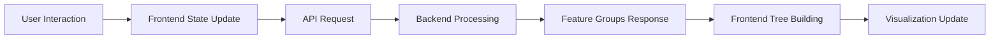

# CLAUDE.md - SAE Feature Visualization Project

Professional guidance for working with the SAE Feature Visualization research prototype.

## Project Overview

**Purpose**: Research prototype for visualizing consistency between interpretability scoring methods for Sparse Autoencoder (SAE) features. Designed for EuroVIS conference demonstration.

**Status**: Conference-ready research prototype - All 8 phases complete
**Dataset**: 1,648 features with multiple LLM explainers and scorers
**Architecture**: Simplified backend (feature grouping) + smart frontend (tree building)

## 🎯 Important Development Principles

### This is a Conference Prototype
- **Avoid over-engineering**: Prioritize working demonstrations over production-level architecture
- **Simple solutions first**: Use straightforward implementations suitable for research demonstrations
- **No premature optimization**: Focus on functionality and clarity over complex optimizations
- **Flexibility over robustness**: Easy modification for research exploration is more valuable than production hardening

### Code Quality Guidelines
1. **Clean up after modifications**: Always remove unused code, commented-out sections, and obsolete styles
2. **Analyze before adding**: Check existing code for similar functionality before implementing new features
3. **Reuse and modularize**: Extract common patterns into reusable functions/utilities when beneficial
4. **Keep it maintainable**: Code should be easy to understand and modify for research iterations

## 🔄 Comprehensive Data Flow Architecture

### High-Level Data Flow


### Detailed System Architecture
```
┌────────────────────────────────────────────────────────────────────────────┐
│                              USER INTERFACE                                │
│  Dual Sankey │ Alluvial │ TablePanel │ Histograms │ LLM Compare │ UMAP    │
└────────────────────────────────────────────────────────────────────────────┘
                                      ↕
┌────────────────────────────────────────────────────────────────────────────┐
│                         FRONTEND (React + TypeScript)                      │
│                                                                            │
│  ┌──────────────────────────────────────────────────────────────┐        │
│  │                    Tree-Based Sankey Builder                   │        │
│  │  • Feature Group Cache (by metric:thresholds)                 │        │
│  │  • Set Intersection Algorithm (O(min(|A|,|B|))               │        │
│  │  • Map<nodeId, SankeyTreeNode> Tree Structure                │        │
│  │  • Instant threshold updates without backend calls            │        │
│  └──────────────────────────────────────────────────────────────┘        │
│                                                                            │
│  ┌──────────────────────────────────────────────────────────────┐        │
│  │                    Zustand State Management                    │        │
│  │  • Modularized: index, sankey-actions, table-actions         │        │
│  │  • Dual-panel state (left/right independent)                 │        │
│  │  • Comparison overlay toggle                                  │        │
│  │  • Runtime stage creation/removal                            │        │
│  └──────────────────────────────────────────────────────────────┘        │
│                                                                            │
│  ┌──────────────────────────────────────────────────────────────┐        │
│  │                    D3.js Visualizations                        │        │
│  │  • Sankey with inline histograms                              │        │
│  │  • Alluvial cross-panel flows                                │        │
│  │  • TablePanel with highlighting                              │        │
│  │  • UMAP projections                                          │        │
│  └──────────────────────────────────────────────────────────────┘        │
└────────────────────────────────────────────────────────────────────────────┘
                                      ↕
                        POST /api/feature-groups
                        {filters, metric, thresholds}
                                      ↕
┌────────────────────────────────────────────────────────────────────────────┐
│                         BACKEND (FastAPI + Polars)                        │
│                                                                            │
│  ┌──────────────────────────────────────────────────────────────┐        │
│  │                 Simple Feature Grouping Service                │        │
│  │  • Apply filters to dataset                                   │        │
│  │  • Group by N thresholds → N+1 groups                        │        │
│  │  • Return feature IDs per group                              │        │
│  │  • Support standard + consistency metrics                    │        │
│  └──────────────────────────────────────────────────────────────┘        │
│                                                                            │
│  ┌──────────────────────────────────────────────────────────────┐        │
│  │                    Data Processing Layer                       │        │
│  │  • Polars lazy evaluation                                     │        │
│  │  • String cache optimization                                  │        │
│  │  • Pre-computed consistency scores                           │        │
│  │  • Sub-second response times                                 │        │
│  └──────────────────────────────────────────────────────────────┘        │
└────────────────────────────────────────────────────────────────────────────┘
                                      ↕
┌────────────────────────────────────────────────────────────────────────────┐
│                              DATA STORAGE                                 │
│  • feature_analysis.parquet (1,648 features)                             │
│  • consistency_scores.parquet (8 pre-computed metrics)                    │
│  • UMAP projections (JSON)                                               │
│  • LLM comparison stats (JSON)                                           │
└────────────────────────────────────────────────────────────────────────────┘
```

## 🎯 Core Architectural Principle: Simplicity + Performance

### The Key Innovation: Frontend Tree Building
```
Traditional Approach:
  Backend builds entire Sankey tree → Heavy computation → Slow threshold updates

Our Approach:
  Backend returns simple groups → Frontend builds tree → Instant threshold updates
```

### How It Works:

#### 1. Backend: Simple Feature Grouping
```python
Request: {filters: {...}, metric: "semdist_mean", thresholds: [0.3, 0.7]}
         ↓
Backend: Filter features → Group by thresholds → Return groups
         ↓
Response: {
  groups: [
    {group_index: 0, range_label: "< 0.30", feature_ids: [1,5,12,...], count: 245},
    {group_index: 1, range_label: "0.30-0.70", feature_ids: [2,8,15,...], count: 892},
    {group_index: 2, range_label: ">= 0.70", feature_ids: [3,9,18,...], count: 511}
  ]
}
```

#### 2. Frontend: Smart Tree Building
```typescript
// Cache feature groups globally
featureGroupCache["semdist_mean:0.3,0.7"] = response.groups

// Build Sankey tree using set intersection
function buildChildNodes(parent: SankeyTreeNode, groups: FeatureGroup[]) {
  for (const group of groups) {
    const childFeatures = intersection(parent.featureIds, group.feature_ids)
    if (childFeatures.size > 0) {
      createChildNode(parent, childFeatures, group.range_label)
    }
  }
}

// Result: Instant threshold updates without backend calls!
```

#### 3. Performance Benefits
- **Cached Groups**: Same metric+thresholds = instant tree rebuild
- **Set Intersection**: O(min(|A|,|B|)) complexity
- **Local Updates**: Threshold changes don't hit backend
- **Stateless Backend**: Scales horizontally
- **Result**: ~50ms for new groups, instant for cached

## 📊 Current Implementation Status

### ✅ Phase 1: Dual-Panel Sankey (COMPLETE)
- Independent left/right panel states
- D3-based Sankey with interactive nodes
- Multi-select filter system
- Histogram popovers

### ✅ Phase 2: Tree-Based Architecture (COMPLETE)
- Map-based tree structure (`Map<nodeId, SankeyTreeNode>`)
- Feature group caching by `metric:thresholds`
- Set intersection for child nodes
- Runtime stage creation/removal
- Alluvial cross-panel flows

### ✅ Phase 3: Performance Optimization (COMPLETE)
- Global feature group cache
- Instant threshold updates
- Stateless backend design
- ~50ms new groups, instant cached

### ✅ Phase 4: Threshold Groups (COMPLETE)
- HistogramPanel with 5 metrics
- ThresholdGroupPanel UI
- Named groups with visibility toggle
- Drag-to-select histogram bars
- Professional styling

### ✅ Phase 5: LLM Comparison (COMPLETE)
- Triangle-based visualization
- Consistency scoring (green→yellow→red)
- Pre-calculated statistics
- Interactive selection

### ✅ Phase 6: UMAP Visualization (COMPLETE)
- Dual-panel projections
- Hierarchical clustering
- Convex hull overlays
- Cross-panel linking

### ✅ Phase 7: TablePanel (COMPLETE)
- 824 rows × multiple explainers
- 5 consistency types
- Cell group selection
- Saved groups management
- Dynamic sorting

### ✅ Phase 8: Consistency Integration (COMPLETE)
- Pre-computed consistency scores
- 8 consistency metrics
- Sankey stage support
- Backend integration

## 🛠️ Technology Stack

### Frontend
- **React 19.1.1** + **TypeScript 5.8.3**
- **Zustand 5.0.8** (modularized state)
- **D3.js** (complete visualization suite)
- **Vite 7.1.6** (dev server)
- **Axios 1.12.2** (API client)

### Backend
- **FastAPI 0.104.1** (async web framework)
- **Polars 0.19.19** (data processing)
- **Uvicorn 0.24.0** (ASGI server)
- **Pydantic 2.5.0** (validation)

### Data
- **Parquet** (columnar storage)
- **JSON** (UMAP, LLM stats)
- **1,648 features** analyzed
- **8 consistency metrics** pre-computed

## 📁 Project Structure

```
/home/dohyun/interface/
├── frontend/           # React application
│   ├── src/
│   │   ├── components/    # UI components
│   │   ├── lib/          # D3 utilities
│   │   ├── store/        # Zustand state
│   │   ├── types.ts      # TypeScript types
│   │   └── api.ts        # API client
│   └── CLAUDE.md         # Frontend docs
├── backend/            # FastAPI server
│   ├── app/
│   │   ├── api/          # Endpoints
│   │   ├── models/       # Pydantic schemas
│   │   └── services/     # Business logic
│   └── CLAUDE.md         # Backend docs
├── data/              # Data files
│   ├── master/           # Parquet files
│   ├── umap_*/          # UMAP JSONs
│   └── llm_comparison/   # LLM stats
└── CLAUDE.md          # This file
```

## 🚀 Development Commands

### Quick Start
```bash
# Backend (port 8003)
cd backend
pip install -r requirements.txt
python start.py --reload --log-level debug

# Frontend (port 3003)
cd frontend
npm install
npm run dev -- --port 3003

# Test API
cd backend
python test_api.py
```

### Current Active Servers
- **Backend**: http://localhost:8003 (API + Swagger docs)
- **Frontend**: http://localhost:3003 (React dev server)

## 🔑 Key Implementation Details

### Frontend Tree Building Algorithm
```typescript
// store/sankey-actions.ts
async function addStageToNode(nodeId: string, metric: string) {
  // 1. Check cache
  const cacheKey = `${metric}:${thresholds.join(',')}`
  let groups = featureGroupCache[cacheKey]

  // 2. Fetch if not cached
  if (!groups) {
    groups = await api.getFeatureGroups(filters, metric, thresholds)
    featureGroupCache[cacheKey] = groups
  }

  // 3. Build child nodes using set intersection
  const parent = sankeyTree.get(nodeId)
  for (const group of groups) {
    const childFeatures = intersection(parent.featureIds, group.feature_ids)
    if (childFeatures.size > 0) {
      const childNode = {
        id: `${nodeId}_group${group.group_index}`,
        parentId: nodeId,
        featureIds: childFeatures,
        featureCount: childFeatures.size,
        rangeLabel: group.range_label,
        metric,
        thresholds
      }
      sankeyTree.set(childNode.id, childNode)
    }
  }
}
```

### Backend Feature Grouping
```python
# services/feature_group_service.py
def get_feature_groups(filters, metric, thresholds):
    # 1. Apply filters
    filtered_df = df.filter(build_filter_expression(filters))

    # 2. Group by thresholds (N thresholds → N+1 groups)
    groups = []
    for i, (min_val, max_val) in enumerate(get_ranges(thresholds)):
        group_df = filtered_df.filter(
            (pl.col(metric) >= min_val) & (pl.col(metric) < max_val)
        )
        groups.append({
            "group_index": i,
            "range_label": format_range(min_val, max_val),
            "feature_ids": group_df["feature_id"].to_list(),
            "count": len(group_df)
        })

    return {"groups": groups}
```

## 🎨 Advanced Features

### Visualization Capabilities
- **Dual Sankey**: Independent left/right panels with comparison overlay
- **Inline Histograms**: Embedded directly on Sankey nodes
- **Threshold Handles**: Interactive threshold manipulation
- **Alluvial Flows**: Cross-panel feature tracking
- **TablePanel**: 824-row scoring table with highlighting
- **UMAP**: Dual projections with clustering
- **LLM Comparison**: Triangle-based consistency viz

### Performance Features
- **Feature Group Caching**: Instant threshold updates
- **Set Intersection**: Efficient tree building
- **Lazy Evaluation**: Polars query optimization
- **Memoization**: React.memo, useMemo, useCallback
- **Debouncing**: 300ms for smooth interactions

### Research Features
- **8 Consistency Metrics**: Pre-computed for performance
- **Multiple LLM Models**: Llama, Qwen, OpenAI
- **Flexible Filtering**: Complex boolean logic
- **Export Support**: CSV/JSON for analysis
- **Real-time Updates**: Live threshold manipulation

## 📈 Performance Metrics

### Response Times
- Filter Options: ~50ms
- Feature Groups: ~50ms (new), instant (cached)
- Histogram Data: ~200ms
- Table Data: ~300ms
- LLM Comparison: ~10ms
- UMAP Data: ~20ms

### Dataset Scale
- 1,648 unique features
- 2,471 total rows (with explainer variants)
- 3 LLM explainers
- 3 LLM scorers
- 8 consistency metrics

## 🎯 Design Philosophy

### Core Principles
1. **Simplicity First**: Backend does simple grouping, frontend handles complexity
2. **Performance**: Instant updates through caching and local computation
3. **Flexibility**: Research-oriented with easy modification
4. **Reliability**: Conference-ready with error handling
5. **Maintainability**: Clean separation of concerns

### Architecture Benefits
- **Stateless Backend**: Easy to scale horizontally
- **Smart Frontend**: Leverages client computation power
- **Clear Data Flow**: Simple request/response pattern
- **Fast Iteration**: Instant threshold experimentation
- **Research Focus**: Optimized for exploration, not production

## 📋 Development Workflow

### Before Making Changes
1. **Search for existing patterns**: Use Grep/Glob to find similar implementations
2. **Ask about reusability**: Check if existing utilities can be extended rather than duplicated
3. **Understand the context**: Read related code to maintain consistency

### After Making Changes
1. **Remove dead code**: Delete unused functions, components, and imports
2. **Clean up styles**: Remove unused CSS classes and obsolete style definitions
3. **Update types**: Ensure TypeScript definitions reflect changes
4. **Test basic functionality**: Verify the feature works as intended for demonstrations

### Development Guidelines
1. **Type Safety**: Maintain TypeScript definitions in frontend
2. **State Management**: Use Zustand actions, not direct state updates
3. **API Changes**: Update both frontend api.ts and backend models
4. **Code Reuse**: Modularize common patterns; check lib/ and services/ directories first

## 🚨 Important Notes

### Data Dependencies
- **Master Data**: `/data/master/feature_analysis.parquet` (required)
- **Consistency**: `/data/master/consistency_scores.parquet` (required)
- **LLM Stats**: `/data/llm_comparison/llm_comparison_stats.json`
- **UMAP Data**: `/data/umap_*/` directories

### Common Tasks
```bash
# Check API health
curl http://localhost:8003/health

# View API docs
open http://localhost:8003/docs

# Watch backend logs
python start.py --reload --log-level debug

# Frontend with specific port
npm run dev -- --port 3003

# Run API tests
python test_api.py
```

## 📊 API Endpoints Summary

| Endpoint | Purpose | Response Time |
|----------|---------|---------------|
| GET /api/filter-options | Filter choices | ~50ms |
| POST /api/feature-groups | **PRIMARY** - Feature grouping | ~50ms |
| POST /api/histogram-data | Histogram bins | ~200ms |
| POST /api/table-data | Scoring table | ~300ms |
| POST /api/comparison-data | Alluvial flows | ~100ms |
| POST /api/llm-comparison | LLM consistency | ~10ms |
| POST /api/umap-data | UMAP projections | ~20ms |
| GET /api/feature/{id} | Feature details | ~10ms |

## 🎓 Conference Demonstration Ready

This platform is optimized for **academic conference presentations**:
- **Live Demos**: Reliable performance with error recovery
- **Interactive**: Real-time threshold manipulation
- **Visual Impact**: 7 visualization types
- **Research Focus**: Explore SAE feature reliability
- **Flexible**: Easy to modify for different scenarios

The simplified architecture (backend grouping + frontend tree building) provides the balance of performance, flexibility, and maintainability needed for research demonstrations.

---

## 💡 Remember

**This is a research prototype for conference demonstrations**

When working on this codebase:
- Prioritize simple, working solutions over production-level engineering
- Clean up unused code and styles after each modification
- Check existing code for reusable patterns before implementing new features
- Keep modifications focused on research demonstration needs
- Maintain code clarity for easy iteration and exploration

The goal is a flexible, maintainable research tool, not a production system.