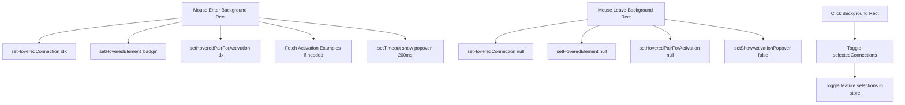

# Decoder Similarity Hover & Rendering Analysis

## Overview
This document provides a detailed analysis of the hover effect and rendering implementation for the decoder similarity visualization in the SAE Feature Visualization project.

## Architecture Summary

### Component Hierarchy
```
DecoderSimilarityTable.tsx (Parent)
  └─> DecoderSimilarityOverlay.tsx (Overlay with hover logic)
        ├─> SVG Visualization (circles, lines, badges)
        └─> Activation Popover (HTML overlay)
```

### Key Innovation: Background Rectangle Interaction Pattern
All interactive elements are **visual-only** (`pointerEvents: 'none'`). A single **background rectangle** handles all mouse events, providing:
- Larger hit target for better UX
- Simplified event handling (no z-index conflicts)
- Clean separation of visual and interaction layers

---

## 1. Hover State Management

### State Variables (DecoderSimilarityOverlay.tsx:160-169)
```typescript
// Visual highlighting for connection (line, circles, badge)
const [hoveredConnection, setHoveredConnection] = useState<number | null>(null)
const [hoveredElement, setHoveredElement] = useState<'line' | 'circle-main' | 'circle-similar' | 'badge' | null>(null)

// Persistent selection (supports multiple selections)
const [selectedConnections, setSelectedConnections] = useState<Set<number>>(new Set())

// Activation popover display
const [hoveredPairForActivation, setHoveredPairForActivation] = useState<number | null>(null)
const [showActivationPopover, setShowActivationPopover] = useState<boolean>(false)
```

### State Flow Diagram


---

## 2. Background Rectangle: The Interaction Layer

### Implementation (DecoderSimilarityOverlay.tsx:345-419)

**Key Characteristics**:
- **Render Order**: First (lowest z-index, behind everything)
- **Dimensions**: 35px wide, full height from main to similar circle
- **Rounded Corners**: 4px border-radius for modern look
- **Pointer Events**: Only enabled when `onBadgeInteraction` provided

```typescript
{similarOnly.map((similar, idx) => {
  const x = xPositions[idx]
  const circleRowIndex = idx + 1
  const circleY = circleRowIndex * rowHeightActual + rowHeightActual / 2
  const isHovered = hoveredConnection === idx
  const isSelected = selectedConnections.has(idx)
  const isHighlighted = isHovered || isSelected

  // Background rectangle dimensions
  const bgWidth = 35
  const bgHeight = circleY - mainRowCenterY
  const bgX = x - bgWidth / 2
  const bgY = mainRowCenterY

  return (
    <rect
      key={`bg-${similar.feature_id}`}
      x={bgX}
      y={bgY}
      width={bgWidth}
      height={bgHeight}
      rx={4}
      ry={4}
      fill={
        isHighlighted
          ? 'rgba(16, 185, 129, 0.08)'  // Light green when highlighted
          : 'rgba(156, 163, 175, 0.05)'  // Minimal gray normally
      }
      stroke={
        isHighlighted
          ? '#10b981'  // Green border when highlighted
          : 'transparent'
      }
      strokeWidth={isHighlighted ? 2 : 0}
      style={{
        pointerEvents: onBadgeInteraction && mainFeatureId !== undefined ? 'auto' : 'none',
        cursor: 'pointer',
        transition: 'all 0.15s ease'
      }}
      onMouseEnter={() => {
        // THREE simultaneous actions:

        // 1. Visual highlighting
        handleConnectionHoverEnter(idx, 'badge')

        // 2. Badge interaction callback (for inter-feature highlighting in table)
        if (onBadgeInteraction && mainFeatureId !== undefined) {
          onBadgeInteraction(mainFeatureId, similar.feature_id, similar.inter_feature_similarity, false)
        }

        // 3. Activation popover logic
        if (mainFeatureId !== undefined) {
          setHoveredPairForActivation(idx)

          // Check cache and fetch if needed
          const featuresToFetch = []
          if (!activationExamples[mainFeatureId]) featuresToFetch.push(mainFeatureId)
          if (!activationExamples[similar.feature_id]) featuresToFetch.push(similar.feature_id)
          if (featuresToFetch.length > 0) {
            fetchActivationExamples(featuresToFetch)
          }

          // Delayed show to prevent flashing on quick hovers
          setTimeout(() => setShowActivationPopover(true), 200)
        }
      }}
      onMouseLeave={() => {
        // Clean up all hover states
        handleConnectionHoverLeave()
        if (onBadgeLeave) {
          onBadgeLeave()
        }
        setHoveredPairForActivation(null)
        setShowActivationPopover(false)
      }}
      onClick={() => {
        handleConnectionClick(idx)
        // Note: Activation highlighting only on hover, not on click
      }}
    />
  )
})}
```

### Why This Pattern Works

**Traditional Approach Problems**:
- Multiple overlapping interactive elements
- Z-index conflicts
- Complex event propagation
- Small hit targets (circles, thin lines)

**Background Rectangle Solution**:
- Single event handler per connection
- Larger, easier-to-target interaction area
- No z-index conflicts (visual elements have `pointerEvents: 'none'`)
- Clean separation: background handles logic, visuals just render

---

## 3. Visual Layer Rendering

### Render Order (Bottom to Top)
1. Background rectangles (interaction layer)
2. Lines (connection visualization)
3. Badges on lines (relationship pattern)
4. Circles (decoder similarity strength)
5. Badges on circles (individual pattern types)
6. Activation popover (HTML overlay, outside SVG)

### Lines with Center Badges (DecoderSimilarityOverlay.tsx:421-466)

```typescript
{similarOnly.map((similar, idx) => {
  const x = xPositions[idx]
  const circleRowIndex = idx + 1
  const circleY = circleRowIndex * rowHeightActual + rowHeightActual / 2
  const isHovered = hoveredConnection === idx
  const isSelected = selectedConnections.has(idx)
  const isHighlighted = isHovered || isSelected
  const relationshipPatternType = similar.inter_feature_similarity?.pattern_type || 'None'
  const midY = (mainRowCenterY + circleY) / 2  // Badge position at line center

  return (
    <g key={`connection-${similar.feature_id}`}>
      {/* Line - visual only, background handles interaction */}
      <line
        className={isHighlighted ? 'decoder-connection--highlighted' : ''}
        x1={x}
        y1={mainRowCenterY}
        x2={x}
        y2={circleY}
        stroke={isHighlighted ? '#10b981' : '#9ca3af'}
        strokeWidth={isHighlighted ? '2.5' : '1.5'}
        opacity={isHighlighted ? '1.0' : '0.8'}
        style={{ pointerEvents: 'none' }}  // ← KEY: No interaction
      />

      {/* Badge at line center - ALWAYS GREEN variant for inter-feature relationship */}
      {onBadgeInteraction && mainFeatureId !== undefined && (
        <foreignObject
          x={x - 20}
          y={midY - 10}
          width={40}
          height={30}
          style={{ pointerEvents: 'none', overflow: 'visible' }}
        >
          <DecoderBadge
            patternType={relationshipPatternType as 'Lexical' | 'Semantic' | 'Both' | 'None'}
            isHovered={isHighlighted}
            variant="green"  // ← Always green for inter-feature similarity
          />
        </foreignObject>
      )}
    </g>
  )
})}
```

**Visual Feedback on Hover**:
- Line: Changes from `#9ca3af` (gray) to `#10b981` (green)
- Line width: Increases from `1.5` to `2.5`
- Opacity: Increases from `0.8` to `1.0`
- Badge: Gets `decoder-stage-table__badge--hover` class

### Circles with Top/Bottom Badges (DecoderSimilarityOverlay.tsx:468-544)

```typescript
{similarOnly.map((similar, idx) => {
  const x = xPositions[idx]
  const circleRowIndex = idx + 1
  const circleY = circleRowIndex * rowHeightActual + rowHeightActual / 2
  const isHovered = hoveredConnection === idx
  const isSelected = selectedConnections.has(idx)
  const isHighlighted = isHovered || isSelected
  const similarFeaturePatternType = similar.pattern_type || 'None'
  const radius = getCircleRadius(similar.cosine_similarity)

  return (
    <g key={similar.feature_id}>
      {/* Circle in main feature row */}
      <circle
        className={isHighlighted ? 'decoder-circle--highlighted' : ''}
        cx={x}
        cy={mainRowCenterY}
        r={radius}
        fill={getMetricColor('decoder_similarity', similar.cosine_similarity, true)}
        opacity={1.0}
        stroke={isHighlighted ? '#10b981' : 'none'}
        strokeWidth={isHighlighted ? '2' : '0'}
        style={{ pointerEvents: 'none' }}  // ← No interaction
      />

      {/* Badge ABOVE main circle - shows main feature pattern */}
      <foreignObject
        x={x - 20}
        y={mainRowCenterY - radius - 22}  // Above circle
        width={40}
        height={30}
        style={{ pointerEvents: 'none', overflow: 'visible' }}
      >
        <DecoderBadge
          patternType={mainFeaturePatternType as 'Lexical' | 'Semantic' | 'Both' | 'None'}
          isHovered={isHighlighted}
        />
      </foreignObject>

      {/* Circle at target row */}
      <circle
        cx={x}
        cy={circleY}
        r={radius}
        fill={getMetricColor('decoder_similarity', similar.cosine_similarity, true)}
        stroke={isHighlighted ? '#10b981' : 'none'}
        strokeWidth={isHighlighted ? '2' : '0'}
        style={{ pointerEvents: 'none' }}
      />

      {/* Badge BELOW similar circle - shows similar feature pattern */}
      <foreignObject
        x={x - 20}
        y={circleY + radius + 2}  // Below circle
        width={40}
        height={30}
        style={{ pointerEvents: 'none', overflow: 'visible' }}
      >
        <DecoderBadge
          patternType={similarFeaturePatternType as 'Lexical' | 'Semantic' | 'Both' | 'None'}
          isHovered={isHighlighted}
        />
      </foreignObject>
    </g>
  )
})}
```

**Visual Feedback on Hover**:
- Circles: Green stroke appears (`#10b981`, width `2`)
- Badges: Get hover styling via `isHovered` prop

### Badge Component (DecoderSimilarityOverlay.tsx:110-140)

```typescript
const DecoderBadge: React.FC<DecoderBadgeProps> = ({
  patternType,
  isHovered = false,
  variant = 'default'
}) => {
  const hoverClass = isHovered ? ' decoder-stage-table__badge--hover' : ''
  const variantClass = variant === 'green' ? ' decoder-stage-table__badge--green' : ''

  if (patternType === 'Both') {
    return (
      <div className="decoder-stage-table__badge-stack decoder-stage-table__badge--compact">
        <span className={`decoder-stage-table__badge decoder-stage-table__badge--lexical decoder-stage-table__badge--compact${hoverClass}${variantClass}`}>
          LEX
        </span>
        <span className={`decoder-stage-table__badge decoder-stage-table__badge--semantic decoder-stage-table__badge--compact${hoverClass}${variantClass}`}>
          SEM
        </span>
      </div>
    )
  } else if (patternType === 'Lexical') {
    return (
      <span className={`decoder-stage-table__badge decoder-stage-table__badge--lexical decoder-stage-table__badge--compact${hoverClass}${variantClass}`}>
        LEX
      </span>
    )
  } else if (patternType === 'Semantic') {
    return (
      <span className={`decoder-stage-table__badge decoder-stage-table__badge--semantic decoder-stage-table__badge--compact${hoverClass}${variantClass}`}>
        SEM
      </span>
    )
  } else {
    return null  // Don't render "None" badges
  }
}
```

**Badge Variants**:
- **Default**: Blue/purple styling for individual feature patterns
- **Green**: Green styling for inter-feature relationship patterns

---

## 4. Activation Popover Rendering

### Conditional Rendering Logic (DecoderSimilarityOverlay.tsx:547-588)

```typescript
{showActivationPopover && hoveredPairForActivation !== null && mainFeatureId !== undefined && (
  (() => {
    const similar = similarOnly[hoveredPairForActivation]
    const mainExamples = activationExamples[mainFeatureId]
    const similarExamples = activationExamples[similar.feature_id]

    // Only show if both features have activation examples loaded
    if (!mainExamples || !similarExamples) return null

    // Calculate popover position based on hovered row
    const rowHeightActual = containerHeight / rowCount
    const popoverTop = (hoveredPairForActivation + 1) * rowHeightActual

    return (
      <div
        className="decoder-activation-popover"
        style={{
          maxWidth: activationColumnWidth || 800,
          top: popoverTop,
          left: 'calc(100% + 250px)'  // Position in activation column
        }}
      >
        {/* Main Feature Section */}
        <div className="decoder-activation-popover__feature">
          <div className="decoder-activation-popover__feature-label">
            Feature {mainFeatureId}
          </div>
          {[0, 1, 2, 3].map(qIndex => renderQuantileExample(mainExamples, qIndex))}
        </div>

        {/* Similar Feature Section */}
        <div className="decoder-activation-popover__feature">
          <div className="decoder-activation-popover__feature-label">
            Feature {similar.feature_id}
          </div>
          {[0, 1, 2, 3].map(qIndex => renderQuantileExample(similarExamples, qIndex))}
        </div>
      </div>
    )
  })()
)}
```

### Positioning Strategy

**Vertical Position** (`top`):
```typescript
const popoverTop = (hoveredPairForActivation + 1) * rowHeightActual
```
- Aligns with the hovered row (not the main row)
- `+1` accounts for 0-indexing

**Horizontal Position** (`left`):
```typescript
left: 'calc(100% + 250px)'
```
- `100%` = right edge of decoder similarity column
- `+250px` = offset to clear inter-feature similarity column
- Result: Popover appears in activation column

**Width Constraint**:
```typescript
maxWidth: activationColumnWidth || 800
```
- Passed from parent `DecoderSimilarityTable`
- Measured once using `ResizeObserver` (DecoderSimilarityTable.tsx:260-281)

### Quantile Example Rendering (DecoderSimilarityOverlay.tsx:279-328)

```typescript
const renderQuantileExample = (examples: ActivationExamples, quantileIndex: number) => {
  // Determine n-gram type (char vs word) based on Jaccard scores
  const ngramInfo = getNgramUnderlineType(examples)
  const underlineType = ngramInfo.type
  const ngramJaccard = ngramInfo.jaccard

  const example = examples.quantile_examples.find(ex => ex.quantile_index === quantileIndex)
  if (!example) return null

  // Build 32-token window
  const tokens = buildActivationTokens(example, 32)

  return (
    <div key={quantileIndex} className="decoder-activation-popover__quantile-row">
      {tokens.map((token, tokenIdx) => {
        const hasUnderline = shouldUnderlineToken(token.position, example, underlineType)
        const ngramClass = hasUnderline ? getNgramConfidenceClass(ngramJaccard) : ''

        // Build title with activation and n-gram info
        let title = token.activation_value?.toFixed(3) || 'No activation'
        if (hasUnderline) {
          const ngramText = underlineType === 'char'
            ? examples.top_char_ngram_text
            : examples.top_word_ngram_text
          title += `\nN-gram pattern: "${ngramText}" (Jaccard: ${ngramJaccard.toFixed(3)})`
        }

        return (
          <span
            key={tokenIdx}
            className={`activation-token ${token.is_max ? 'activation-token--max' : ''} ${token.is_newline ? 'activation-token--newline' : ''} ${ngramClass}`}
            style={{
              backgroundColor: token.activation_value
                ? getActivationColor(token.activation_value, example.max_activation)
                : 'transparent'
            }}
            title={title}
          >
            {token.is_newline ? (
              <span className="newline-symbol">{getWhitespaceSymbol(token.text)}</span>
            ) : (
              token.text
            )}
          </span>
        )
      })}
    </div>
  )
}
```

**Token Rendering Features**:
1. **Color Coding**: Background color based on activation strength
2. **N-gram Underlines**: Lexical patterns highlighted
3. **Whitespace Symbols**: `↵` for newlines, `→` for tabs, `·` for spaces
4. **Tooltips**: Show activation value and n-gram pattern info

---

## 5. Data Fetching & Caching

### Global Cache Integration

```typescript
// Access global store
const activationExamples = useVisualizationStore(state => state.activationExamples)
const fetchActivationExamples = useVisualizationStore(state => state.fetchActivationExamples)
```

### Cache Check Before Fetch (DecoderSimilarityOverlay.tsx:394-399)

```typescript
// Check cache and fetch if needed
const featuresToFetch = []
if (!activationExamples[mainFeatureId]) featuresToFetch.push(mainFeatureId)
if (!activationExamples[similar.feature_id]) featuresToFetch.push(similar.feature_id)
if (featuresToFetch.length > 0) {
  fetchActivationExamples(featuresToFetch)
}
```

**Benefits**:
- Prevents redundant API calls
- Instant popover display if data cached
- Smooth UX with minimal loading states

### Delayed Display (DecoderSimilarityOverlay.tsx:401)

```typescript
setTimeout(() => setShowActivationPopover(true), 200)
```

**Why 200ms delay?**:
- Prevents popover flashing when user quickly moves mouse across multiple connections
- Only shows if user intentionally hovers for >200ms
- Improves perceived performance

---

## 6. Performance Optimizations

### 1. Single-Pass Rendering
All visual elements rendered in one SVG, no separate components per connection.

### 2. Minimal Re-renders
```typescript
// Only re-calculate when dependencies change
const xPositions = useMemo(() => {
  return similarOnly.map((_, idx) => startX + (idx * spacing))
}, [similarOnly, startX, spacing])
```

### 3. Efficient Event Handling
- One event handler per connection (not per visual element)
- No event bubbling conflicts
- Clean state updates

### 4. Lazy Popover Rendering
Popover only renders when:
- `showActivationPopover === true`
- `hoveredPairForActivation !== null`
- `mainFeatureId !== undefined`
- Both activation examples loaded

### 5. SVG Optimization
```typescript
// Padding calculation for badges below circles
const svgHeight = containerHeight + 42
// Bottom badge: radius (~5-8px) + offset (4px) + badge height (30px) = ~42px buffer
```
Precise sizing prevents unnecessary overflow/scrollbars.

---

## 7. Styling & Visual Design

### Color Palette

**Hover/Selection**:
- Background: `rgba(16, 185, 129, 0.08)` (light green, 8% opacity)
- Stroke: `#10b981` (green-500)
- Line: `#10b981` (green-500)

**Normal State**:
- Background: `rgba(156, 163, 175, 0.05)` (gray, 5% opacity)
- Line: `#9ca3af` (gray-400)

**Circles**:
- Fill: Gradient from `getMetricColor('decoder_similarity', value, true)`
- Stroke: Green when highlighted

### Transitions

```css
transition: all 0.15s ease
```
Applied to background rectangle for smooth hover feedback.

### Badge Styling
- **Lexical**: Blue background
- **Semantic**: Purple background
- **Both**: Stacked badges
- **Green variant**: Green tint for inter-feature relationships

---

## 8. Integration with Parent Table

### Props Interface (DecoderSimilarityOverlay.tsx:24-32)

```typescript
interface DecoderSimilarityOverlayProps {
  similarFeatures: SimilarFeature[]        // Feature data (main + 4 similar)
  rowCount: number                         // Number of rows for height calculation
  rowHeight: number                        // Row height (46px)
  mainFeatureId?: number                   // Main feature ID for interaction tracking
  onBadgeInteraction?: (                   // Callback for inter-feature highlighting
    mainFeatureId: number,
    similarFeatureId: number,
    interfeatureData: any,
    isClick: boolean
  ) => void
  onBadgeLeave?: () => void                // Callback when mouse leaves
  activationColumnWidth?: number           // Width constraint for popover
}
```

### Parent Usage (DecoderSimilarityTable.tsx:542-550)

```typescript
<td
  className="table-panel__cell table-panel__cell--score"
  style={{ position: 'relative', padding: 0, verticalAlign: 'top' }}
  rowSpan={rowCount}
>
  <DecoderSimilarityOverlay
    similarFeatures={similarFeatures}
    rowCount={rowCount}
    rowHeight={46}
    mainFeatureId={row.feature_id}
    onBadgeInteraction={handleBadgeInteraction}
    onBadgeLeave={handleBadgeLeave}
    activationColumnWidth={activationColumnWidth}
  />
</td>
```

**Key Details**:
- Overlay spans entire feature group (`rowSpan={rowCount}`)
- Positioned relatively to allow absolute positioning of popover
- Zero padding to eliminate spacing issues

---

## 9. Click Interaction: Persistent Selection

### Click Handler (DecoderSimilarityOverlay.tsx:238-276)

```typescript
const handleConnectionClick = (idx: number) => {
  const similar = similarOnly[idx]
  const isCurrentlySelected = selectedConnections.has(idx)

  if (isCurrentlySelected) {
    // DESELECTING
    // Always uncheck similar feature
    if (selectedFeatureIds.has(similar.feature_id)) {
      toggleFeatureSelection(similar.feature_id)
    }

    // Only uncheck main feature if no other pairs remain selected
    const otherSelectedPairs = Array.from(selectedConnections).filter(i => i !== idx)
    if (otherSelectedPairs.length === 0 && mainFeatureId !== undefined && selectedFeatureIds.has(mainFeatureId)) {
      toggleFeatureSelection(mainFeatureId)
    }

    // Remove from visual selection
    setSelectedConnections(prev => {
      const newSet = new Set(prev)
      newSet.delete(idx)
      return newSet
    })
  } else {
    // SELECTING
    // Only check if not already checked
    if (mainFeatureId !== undefined && !selectedFeatureIds.has(mainFeatureId)) {
      toggleFeatureSelection(mainFeatureId)
    }
    if (!selectedFeatureIds.has(similar.feature_id)) {
      toggleFeatureSelection(similar.feature_id)
    }

    // Add to visual selection
    setSelectedConnections(prev => {
      const newSet = new Set(prev)
      newSet.add(idx)
      return newSet
    })
  }
}
```

**Logic**:
- Clicking toggles persistent selection (stays highlighted until clicked again)
- Automatically checks/unchecks corresponding feature checkboxes in table
- Main feature stays selected if any pair remains selected

---

## 10. Key Takeaways

### Design Principles

1. **Separation of Concerns**
   - Interaction layer (background rectangles)
   - Visual layer (SVG elements with `pointerEvents: 'none'`)
   - Data layer (global store cache)

2. **Progressive Enhancement**
   - Works without hover (persistent click selection)
   - Enhanced with hover feedback
   - Popover provides additional context

3. **Performance First**
   - Single-pass rendering
   - Cached data fetching
   - Delayed popover display
   - Minimal re-renders

4. **User Experience**
   - Large hit targets (35px wide rectangles)
   - Clear visual feedback (color, stroke, transitions)
   - Smooth animations (200ms delay, 150ms transitions)
   - Multi-modal interaction (hover + click)

### Architecture Benefits

**Maintainability**:
- Clear separation between interaction and visuals
- Single source of truth for state
- Predictable data flow

**Scalability**:
- Handles 1-4 similar features per main feature
- Virtual scrolling support in parent table
- Global cache prevents redundant fetches

**Flexibility**:
- Optional callbacks for custom behavior
- Configurable dimensions
- Supports both hover and click interactions

---

## 11. Common Patterns for Similar Implementations

### Pattern 1: Background Interaction Layer
```typescript
// Render order: backgrounds → visuals → overlays
<svg>
  {/* Step 1: Background rectangles with events */}
  {items.map((item, idx) => (
    <rect
      style={{ pointerEvents: 'auto', cursor: 'pointer' }}
      onMouseEnter={() => handleHover(idx)}
      onClick={() => handleClick(idx)}
    />
  ))}

  {/* Step 2: Visual elements (no events) */}
  {items.map((item, idx) => (
    <line style={{ pointerEvents: 'none' }} />
  ))}

  {/* Step 3: HTML overlay outside SVG */}
  {showPopover && <div className="popover">...</div>}
</svg>
```

### Pattern 2: Delayed Popover Display
```typescript
const [showPopover, setShowPopover] = useState(false)

onMouseEnter={() => {
  setHoveredItem(idx)
  setTimeout(() => setShowPopover(true), 200)  // Delay prevents flashing
}}

onMouseLeave={() => {
  setHoveredItem(null)
  setShowPopover(false)  // Immediate hide
}}
```

### Pattern 3: Cache-First Data Fetching
```typescript
const handleHover = (id: number) => {
  // Check cache first
  if (!dataCache[id]) {
    // Fetch only if missing
    fetchData(id)
  }
  // Show popover regardless (may show loading state)
  setShowPopover(true)
}
```

### Pattern 4: Dual Hover/Click States
```typescript
const [hoveredItem, setHoveredItem] = useState<number | null>(null)
const [selectedItems, setSelectedItems] = useState<Set<number>>(new Set())

const isHighlighted = (idx: number) => {
  return hoveredItem === idx || selectedItems.has(idx)
}
```

---

## Conclusion

The decoder similarity hover implementation demonstrates a sophisticated approach to interactive data visualization:

- **Technical Excellence**: Clean separation of interaction and visuals
- **Performance**: Optimized rendering and data fetching
- **UX Quality**: Smooth, predictable interactions
- **Maintainability**: Clear patterns and architecture

This implementation serves as a reference for building complex, performant interactive visualizations in React + D3.js applications.
