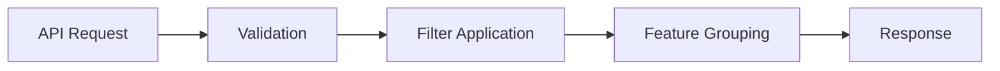

# Backend CLAUDE.md - SAE Feature Visualization FastAPI Server

This document provides comprehensive guidance for the FastAPI backend of the SAE Feature Visualization project. This backend implements a simplified feature grouping service designed to enable frontend-driven tree building for research demonstrations.

## 🎯 Backend Architecture Overview

**Purpose**: Provide simple, stateless feature grouping API for frontend tree building
**Status**: ✅ **PRODUCTION-READY** - 8 endpoints operational, all phases complete
**Key Innovation**: Simplified grouping service enables instant frontend threshold updates

## 🔄 Data Flow Through Backend

### High-Level Request Flow


### Detailed Processing Pipeline
```
┌─────────────────────────────────────────────────────────────────────────────┐
│                           API REQUEST RECEIVED                              │
│  POST /api/feature-groups                                                  │
│  {filters: {...}, metric: "semdist_mean", thresholds: [0.3, 0.7]}        │
└─────────────────────────────────────────────────────────────────────────────┘
                                      ↓
┌─────────────────────────────────────────────────────────────────────────────┐
│                          PYDANTIC VALIDATION                                │
│  • Request model validation                                                │
│  • Type checking and conversion                                            │
│  • Error response if invalid                                               │
└─────────────────────────────────────────────────────────────────────────────┘
                                      ↓
┌─────────────────────────────────────────────────────────────────────────────┐
│                         POLARS DATA PROCESSING                              │
│                                                                             │
│  1. Load feature_analysis.parquet (lazy)                                  │
│  2. Apply filters: df.filter(build_filter_expression(filters))            │
│  3. Group by metric thresholds:                                          │
│     - N thresholds → N+1 groups                                          │
│     - Group 0: metric < 0.3                                              │
│     - Group 1: 0.3 ≤ metric < 0.7                                        │
│     - Group 2: metric ≥ 0.7                                              │
│  4. Extract feature IDs per group                                        │
└─────────────────────────────────────────────────────────────────────────────┘
                                      ↓
┌─────────────────────────────────────────────────────────────────────────────┐
│                           RESPONSE FORMATTING                               │
│  {                                                                         │
│    "groups": [                                                            │
│      {"group_index": 0, "range_label": "< 0.30",                         │
│       "feature_ids": [1,5,12,...], "count": 245},                       │
│      {"group_index": 1, "range_label": "0.30-0.70",                      │
│       "feature_ids": [2,8,15,...], "count": 892},                       │
│      {"group_index": 2, "range_label": ">= 0.70",                        │
│       "feature_ids": [3,9,18,...], "count": 511}                        │
│    ]                                                                       │
│  }                                                                         │
└─────────────────────────────────────────────────────────────────────────────┘
```

## 🏗️ Core Architecture Components

### 1. Simplified Feature Grouping Service

#### The Design Philosophy
Backend focuses on **simple, stateless operations**:
- No tree building
- No state management
- No complex classification
- Just filter → group → return

#### Why This Works
```
Traditional: Backend builds complete visualization structure
            → Complex state management
            → Slow threshold updates
            → Hard to maintain

Our Approach: Backend provides simple groups
             → Frontend builds structure
             → Instant threshold updates
             → Easy to maintain
```

### 2. Service Layer Architecture

#### FeatureGroupService (Primary Service)
```python
# services/feature_group_service.py
class FeatureGroupService:
    """
    Simple feature grouping by thresholds.
    Stateless operations for maximum scalability.
    """

    async def get_feature_groups(
        self,
        filters: Filters,
        metric: str,
        thresholds: List[float]
    ) -> FeatureGroupResponse:
        # 1. Load data (lazy evaluation)
        df = pl.scan_parquet("feature_analysis.parquet")

        # 2. Apply filters
        df = df.filter(self._build_filter_expression(filters))

        # 3. Group by thresholds (N → N+1)
        groups = []
        ranges = self._get_threshold_ranges(thresholds)

        for i, (min_val, max_val) in enumerate(ranges):
            group_df = df.filter(
                (pl.col(metric) >= min_val) &
                (pl.col(metric) < max_val)
            )

            groups.append({
                "group_index": i,
                "range_label": self._format_range(min_val, max_val),
                "feature_ids": group_df["feature_id"].to_list(),
                "count": len(group_df)
            })

        return FeatureGroupResponse(groups=groups)
```

#### ConsistencyService (Phase 8)
```python
# services/consistency_service.py
class ConsistencyService:
    """
    Pre-computed consistency score provider.
    Loads consistency_scores.parquet for instant access.
    """

    @staticmethod
    def get_consistency_scores(feature_ids: List[int]) -> Dict:
        # Load pre-computed scores
        df = pl.read_parquet("consistency_scores.parquet")

        # Filter for requested features
        df = df.filter(pl.col("feature_id").is_in(feature_ids))

        # Return consistency metrics
        return {
            "llm_scorer_consistency": df["llm_scorer_cons"].to_list(),
            "within_explanation": df["within_exp_cons"].to_list(),
            "cross_explanation": df["cross_exp_cons"].to_list(),
            "llm_explainer_consistency": df["llm_exp_cons"].to_list()
        }
```

### 3. FastAPI Application Structure

#### Main Application (app/main.py)
```python
from fastapi import FastAPI
from contextlib import asynccontextmanager

@asynccontextmanager
async def lifespan(app: FastAPI):
    # Startup
    await data_service.initialize()
    print("✅ Data service initialized")
    yield
    # Shutdown
    await data_service.cleanup()
    print("✅ Cleanup complete")

app = FastAPI(
    title="SAE Feature Visualization API",
    lifespan=lifespan
)

# Mount routers
app.include_router(filters_router)
app.include_router(feature_groups_router)  # PRIMARY
app.include_router(histogram_router)
app.include_router(table_router)
# ... other routers
```

## 📊 API Endpoints Documentation

### Primary Endpoint: Feature Groups

#### POST /api/feature-groups
**Purpose**: Group features by metric thresholds
**The Core of the System** - Enables frontend tree building

**Request**:
```json
{
  "filters": {
    "sae_id": ["sae_1"],
    "llm_explainer": ["gpt-4", "claude"],
    "llm_scorer": ["scorer_1"]
  },
  "metric": "semdist_mean",
  "thresholds": [0.3, 0.7]
}
```

**Response**:
```json
{
  "groups": [
    {
      "group_index": 0,
      "range_label": "< 0.30",
      "feature_ids": [1, 5, 12, 23, 45, ...],
      "count": 245
    },
    {
      "group_index": 1,
      "range_label": "0.30 - 0.70",
      "feature_ids": [2, 8, 15, 34, 67, ...],
      "count": 892
    },
    {
      "group_index": 2,
      "range_label": ">= 0.70",
      "feature_ids": [3, 9, 18, 56, 89, ...],
      "count": 511
    }
  ]
}
```

**Key Features**:
- N thresholds always produce N+1 groups
- Feature IDs enable frontend set intersection
- Range labels for display
- Count for quick statistics

### Supporting Endpoints

#### GET /api/filter-options
**Purpose**: Available filter choices
```json
{
  "sae_ids": ["sae_1", "sae_2"],
  "explanation_methods": ["method_1", "method_2"],
  "llm_explainers": ["gpt-4", "claude", "llama"],
  "llm_scorers": ["scorer_1", "scorer_2", "scorer_3"]
}
```

#### POST /api/histogram-data
**Purpose**: Histogram bins for visualization
```json
{
  "data": {
    "bins": [0, 0.1, 0.2, ...],
    "frequencies": [45, 67, 89, ...],
    "total_count": 1648
  }
}
```

#### POST /api/table-data
**Purpose**: Feature scoring table (Phase 7)
```json
{
  "features": [
    {
      "feature_id": 0,
      "scores": {...},
      "consistency": {...}
    }
  ],
  "explainer_ids": [...],
  "scorer_ids": [...]
}
```

#### POST /api/llm-comparison
**Purpose**: LLM consistency statistics (Phase 5)
```json
{
  "explainerConsistencies": {...},
  "scorerConsistencies": {...}
}
```

## 🛠️ Technology Stack

### Core Framework
```python
FastAPI==0.104.1     # Async web framework
Uvicorn==0.24.0      # ASGI server
Pydantic==2.5.0      # Data validation
```

### Data Processing
```python
Polars==0.19.19      # High-performance DataFrames
NumPy==1.25.2        # Numerical operations
```

### Development Tools
```python
pytest==7.4.3        # Testing framework
httpx==0.25.2        # Test client
python-multipart==0.0.6  # Form data support
```

## 📁 Backend Project Structure

```
backend/
├── app/
│   ├── main.py                    # FastAPI application
│   ├── api/                       # API endpoints
│   │   ├── __init__.py           # Router aggregation
│   │   ├── feature_groups.py     # PRIMARY endpoint
│   │   ├── filters.py            # Filter options
│   │   ├── histogram.py          # Histogram data
│   │   ├── table.py              # Table data
│   │   ├── llm_comparison.py     # LLM stats
│   │   ├── comparison.py         # Alluvial flows
│   │   ├── umap.py               # UMAP projections
│   │   └── feature.py            # Feature details
│   ├── models/                    # Pydantic schemas
│   │   ├── requests.py           # Request models
│   │   ├── responses.py          # Response models
│   │   └── common.py             # Shared models
│   └── services/                  # Business logic
│       ├── feature_group_service.py  # Feature grouping
│       ├── data_service.py           # Data loading
│       ├── consistency_service.py    # Consistency scores
│       ├── table_data_service.py     # Table processing
│       └── data_constants.py         # Schema constants
├── data/                          # Data files
│   └── master/
│       ├── feature_analysis.parquet      # Main dataset
│       └── consistency_scores.parquet    # Pre-computed
├── start.py                       # Startup script
├── test_api.py                    # API tests
└── requirements.txt               # Dependencies
```

## 🚀 Development Workflow

### Starting Development
```bash
cd backend

# Install dependencies
pip install -r requirements.txt

# Start with hot reload (port 8003)
python start.py --reload --log-level debug

# Custom port
python start.py --port 8001 --reload
```

### Testing
```bash
# Run comprehensive tests
python test_api.py

# Test specific endpoint
curl -X POST http://localhost:8003/api/feature-groups \
  -H "Content-Type: application/json" \
  -d '{"filters": {}, "metric": "semdist_mean", "thresholds": [0.3, 0.7]}'

# Health check
curl http://localhost:8003/health
```

### Production
```bash
# Production deployment
python start.py --host 0.0.0.0 --port 8000

# Multi-worker
uvicorn app.main:app --workers 4 --host 0.0.0.0 --port 8000
```

## 📊 Performance Characteristics

### Response Time Metrics
| Endpoint | Response Time | Complexity |
|----------|---------------|------------|
| /api/feature-groups | ~50ms | O(n) filtering |
| /api/filter-options | ~50ms | Cached |
| /api/histogram-data | ~200ms | O(n) binning |
| /api/table-data | ~300ms | O(n×m) scores |
| /api/llm-comparison | ~10ms | Static JSON |
| /api/umap-data | ~20ms | Pre-computed |
| /health | ~5ms | Status check |

### Optimization Strategies

#### 1. Lazy Evaluation (Polars)
```python
# Don't load entire dataset
df = pl.scan_parquet("data.parquet")  # Lazy
df = df.filter(conditions)            # Still lazy
df = df.select(columns)               # Still lazy
result = df.collect()                 # Execute here
```

#### 2. String Cache
```python
# Enable for categorical data
with pl.StringCache():
    df = pl.read_parquet("data.parquet")
    # Categorical operations are now faster
```

#### 3. Async Operations
```python
# Non-blocking I/O
async def get_data():
    # Async file operations
    async with aiofiles.open("data.json") as f:
        data = await f.read()
    return json.loads(data)
```

## 🔧 Implementation Patterns

### Error Handling Pattern
```python
from fastapi import HTTPException

@router.post("/api/feature-groups")
async def get_feature_groups(request: FeatureGroupRequest):
    try:
        # Validate filters
        if not validate_filters(request.filters):
            raise HTTPException(
                status_code=400,
                detail={
                    "error": {
                        "code": "INVALID_FILTERS",
                        "message": "Invalid filter values"
                    }
                }
            )

        # Process request
        result = await service.get_feature_groups(request)
        return result

    except ValueError as e:
        raise HTTPException(status_code=400, detail=str(e))
    except Exception as e:
        logger.error(f"Unexpected error: {e}")
        raise HTTPException(status_code=500, detail="Internal error")
```

### Service Pattern
```python
class FeatureGroupService:
    def __init__(self, data_path: str):
        self.data_path = data_path
        self._df = None

    async def initialize(self):
        """Async initialization"""
        self._df = pl.scan_parquet(self.data_path)

    async def get_feature_groups(
        self,
        filters: Filters,
        metric: str,
        thresholds: List[float]
    ) -> FeatureGroupResponse:
        """Main service method"""
        # Implementation
        pass
```

### Dependency Injection Pattern
```python
from fastapi import Depends

# Create service instance
feature_service = FeatureGroupService("data.parquet")

# Inject into endpoint
@router.post("/api/feature-groups")
async def get_feature_groups(
    request: FeatureGroupRequest,
    service: FeatureGroupService = Depends(lambda: feature_service)
):
    return await service.get_feature_groups(request)
```

## 🎯 Key Design Decisions

### Why Simplified Architecture?

#### 1. **Stateless Operations**
- No session management
- No complex state tracking
- Easy horizontal scaling
- Perfect for serverless

#### 2. **Frontend Intelligence**
- Leverage client computing power
- Instant threshold updates
- Rich interactivity
- Reduced server load

#### 3. **Clear Separation**
- Backend: Data filtering and grouping
- Frontend: Tree building and visualization
- Clean API boundaries
- Easy to maintain

### Architecture Benefits
```
Traditional Monolithic Backend:
- Heavy server computation
- Slow threshold updates
- Complex state management
- Hard to scale

Our Approach:
- Light server operations
- Instant client updates
- Stateless simplicity
- Easy to scale
```

## 📈 Data Requirements

### Primary Data Files

#### feature_analysis.parquet
- **Location**: `/data/master/feature_analysis.parquet`
- **Size**: 1,648 unique features
- **Columns**:
  - feature_id (int)
  - sae_id (str)
  - llm_explainer (str)
  - llm_scorer (str)
  - semdist_mean (float)
  - semdist_max (float)
  - score_* (float) - various scores
  - details_path (str)

#### consistency_scores.parquet
- **Location**: `/data/master/consistency_scores.parquet`
- **Purpose**: Pre-computed consistency metrics
- **Columns**:
  - feature_id (int)
  - llm_scorer_consistency (float)
  - within_explanation_consistency (float)
  - cross_explanation_consistency (float)
  - llm_explainer_consistency (float)

### Supporting Data Files
- **LLM Stats**: `/data/llm_comparison/llm_comparison_stats.json`
- **UMAP Data**: `/data/umap_*/` directories
- **Detail JSONs**: `/data/detailed_json/` per-feature files

## 🐛 Common Issues & Solutions

### Issue: Slow response times
**Solution**: Check if Polars is using lazy evaluation properly

### Issue: CORS errors
**Solution**: Ensure frontend port is in allowed origins list

### Issue: Memory issues with large datasets
**Solution**: Use scan_parquet instead of read_parquet

### Issue: Async context errors
**Solution**: Ensure proper lifespan management in FastAPI

## 🔒 Security & Production

### CORS Configuration
```python
app.add_middleware(
    CORSMiddleware,
    allow_origins=[
        "http://localhost:3000",
        "http://localhost:3003",
        # Add production URLs
    ],
    allow_methods=["GET", "POST"],
    allow_headers=["*"]
)
```

### Environment Variables
```python
import os
from dotenv import load_dotenv

load_dotenv()

# Configuration
DATA_PATH = os.getenv("DATA_PATH", "../data/master")
API_PORT = int(os.getenv("API_PORT", "8003"))
LOG_LEVEL = os.getenv("LOG_LEVEL", "INFO")
```

### Rate Limiting
```python
from slowapi import Limiter

limiter = Limiter(key_func=lambda: "global")

@app.get("/api/filter-options")
@limiter.limit("100/minute")
async def get_filter_options():
    # Implementation
```

## 📈 Monitoring & Logging

### Structured Logging
```python
import structlog

logger = structlog.get_logger()

logger.info(
    "feature_grouping_complete",
    metric=metric,
    threshold_count=len(thresholds),
    group_count=len(groups),
    duration_ms=duration
)
```

### Health Endpoint
```python
@app.get("/health")
async def health_check():
    return {
        "status": "healthy",
        "timestamp": datetime.utcnow(),
        "data_service": data_service.is_initialized,
        "version": "1.0.0"
    }
```

## 🎓 Key Takeaways

The backend implements a **simplified grouping service** where:
1. **Stateless operations** enable easy scaling
2. **Simple grouping** reduces complexity
3. **Fast responses** (~50ms) support interactivity
4. **Clear API** makes frontend development easy
5. **Polars optimization** handles large datasets

This architecture provides:
- 🚀 **Fast API responses** for smooth UX
- 📊 **Efficient data processing** with Polars
- 🔄 **Stateless scalability** for production
- 🎯 **Clear responsibilities** for maintenance
- 🏆 **Conference-ready reliability** for demos

---

**Remember**: This backend is optimized for simplicity and performance. The stateless grouping service enables the frontend's advanced tree-building capabilities while maintaining clean separation of concerns.