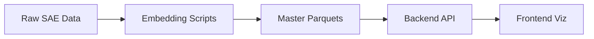

# Data CLAUDE.md - SAE Feature Data Processing & Storage

This document provides comprehensive guidance for the data layer of the SAE Feature Visualization project. This layer transforms raw SAE experimental data into optimized formats for visualization and analysis.

## 🎯 Data Layer Overview

**Purpose**: Transform raw SAE experiments into analysis-ready parquet files
**Status**: ✅ **STREAMLINED PIPELINE V2.0** - 6 core processing scripts
**Key Achievement**: Embedding-first architecture with on-the-fly similarity calculations
**Total Storage**: ~1.2GB (compressed parquet)

## 🔄 Data Flow Architecture

### High-Level Data Pipeline


### Detailed Processing Flow
```
┌─────────────────────────────────────────────────────────────────────────────┐
│                         RAW SAE EXPERIMENTAL DATA                           │
│  • 2,472 explanations from 3 LLM explainers (Llama, Qwen, OpenAI)         │
│  • 824 unique SAE features                                                 │
│  • Multiple scoring methods (fuzz, detection, simulation, embedding)       │
│  • Activation examples with token windows                                  │
└─────────────────────────────────────────────────────────────────────────────┘
                                      ↓
┌─────────────────────────────────────────────────────────────────────────────┐
│                   STREAMLINED PROCESSING PIPELINE (V2.0)                    │
│                                                                             │
│  Script 0a: Activation Examples     → activation_examples.parquet          │
│  Script 0b: Feature Similarities    → feature_similarities.json            │
│  Script 1:  Scores Processing       → scores/*/scores.json                 │
│  Script 2:  Explanation Embeddings  → explanation_embeddings.parquet ⭐    │
│  Script 3:  Features Parquet        → features.parquet (nested) ⭐         │
│  Script 4:  Activation Embeddings   → activation_embeddings.parquet        │
│  Script 5:  Activation Similarity   → activation_example_similarity.parquet│
│                                                                             │
│  ⭐ = V2.0 updates with on-the-fly similarity calculation                  │
└─────────────────────────────────────────────────────────────────────────────┘
                                      ↓
┌─────────────────────────────────────────────────────────────────────────────┐
│                         MASTER DATA FILES (5 PARQUETS)                      │
│                                                                             │
│  PRIMARY:                                                                  │
│  • features.parquet (288KB, 2,472 rows, nested structure)                 │
│  • explanation_embeddings.parquet (7.4MB, 768-dim vectors)                 │
│                                                                             │
│  ACTIVATION DATA:                                                          │
│  • activation_examples.parquet (246MB, 1M+ examples)                       │
│  • activation_embeddings.parquet (985MB, 16K features × 20 embeddings)     │
│  • activation_example_similarity.parquet (2.4MB, similarity metrics)       │
└─────────────────────────────────────────────────────────────────────────────┘
                                      ↓
┌─────────────────────────────────────────────────────────────────────────────┐
│                         BACKEND INTEGRATION                                 │
│  FastAPI loads parquet files → Polars DataFrames → API endpoints          │
└─────────────────────────────────────────────────────────────────────────────┘
                                      ↓
┌─────────────────────────────────────────────────────────────────────────────┐
│                         FRONTEND VISUALIZATION                              │
│  Sankey │ TablePanel │ UMAP │ Alluvial │ LLM Comparison │ Histograms     │
└─────────────────────────────────────────────────────────────────────────────┘
```

## 📁 Directory Structure

```
data/
├── raw/                              # Raw SAE experimental data
│   ├── llama_e-llama_s/             # Llama explainer + scorer (824 features)
│   │   ├── explanations/*.txt       # Explanation text files
│   │   └── scores/                  # Scoring results
│   ├── gwen_e-llama_s/              # Qwen explainer + scorer (824 features)
│   └── openai_e-llama_s/            # OpenAI explainer + scorer (824 features)
│
├── preprocessing/                    # Processing scripts & configs
│   ├── scripts/                     # Python processing pipeline (6 scripts)
│   │   ├── 0_create_activation_examples_parquet.py
│   │   ├── 0_feature_similarities.py
│   │   ├── 1_scores.py
│   │   ├── 2_ex_embeddings.py         ⭐ V2.0 - Multi-source parquet output
│   │   ├── 3_features_parquet.py      ⭐ V2.0 - On-the-fly similarities
│   │   ├── 4_act_embeddings.py        # Pre-compute activation embeddings
│   │   └── 5_act_similarity.py        # Calculate activation similarities
│   └── config/                      # Configuration files (7 configs)
│
├── master/                          # 🎯 PRIMARY DATA FILES
│   ├── features.parquet             # Main dataset (288KB, nested structure)
│   ├── features.parquet.metadata.json
│   ├── explanation_embeddings.parquet # Explanation vectors (7.4MB)
│   ├── explanation_embeddings.parquet.metadata.json
│   ├── activation_examples.parquet  # Activation data (246MB)
│   ├── activation_embeddings.parquet # Pre-computed (985MB)
│   └── activation_example_similarity.parquet # Metrics (2.4MB)
│
├── scores/                          # Processed scoring data
│   ├── llama_e-llama_s/
│   ├── gwen_e-llama_s/
│   └── openai_e-llama_s/
│   └── ... (9 explainer-scorer combinations)
│
├── feature_similarity/              # Decoder weight similarities
│   └── google--gemma-scope-9b-pt-res--layer_30--width_16k--average_l0_120/
│
├── llm_comparison/                  # LLM statistics
│   └── llm_comparison_stats.json    # Pre-calculated consistency
│
├── umap_feature/                    # Feature UMAP projections
│   └── .../umap_embeddings.json     # 1,000 features
│
├── umap_explanations/               # Explanation UMAP projections
│   └── explanation_umap.json        # 2,471 explanations
│
└── umap_clustering/                 # Hierarchical clusters
    ├── feature_clustering.json
    └── explanation_clustering.json
```

## 🏗️ Core Data Files

### 1. features.parquet (PRIMARY - V2.0 SCHEMA)

**The main dataset powering all visualizations with nested structure**

#### Schema
| Column | Type | Description | Notes |
|--------|------|-------------|-------|
| `feature_id` | Int64 | SAE feature index | 0-16383 |
| `sae_id` | Categorical | SAE model identifier | Single value |
| `explanation_method` | Categorical | Explanation generation method | "quantiles" |
| `llm_explainer` | Categorical | LLM for explanations | Llama, Qwen, OpenAI |
| `explanation_text` | Utf8 | Explanation text | Full text |
| `decoder_similarity` | List(Struct) | Similar features | Top 10 neighbors |
| `semantic_similarity` | List(Struct) | **⭐ NEW V2.0** | Pairwise similarities |
| `scores` | List(Struct) | Evaluation scores | All scorers nested |

#### Nested Structure Details

**decoder_similarity**: `List(Struct([feature_id: UInt32, cosine_similarity: Float32]))`
- Top 10 most similar features by decoder weights
- Sorted descending by cosine similarity
- Example: `[{feature_id: 5482, cosine_similarity: 0.442}, ...]`

**semantic_similarity**: `List(Struct([explainer: Categorical, cosine_similarity: Float32]))`
- **NEW IN V2.0**: Replaces `semsim_mean` and `semsim_max`
- Pairwise cosine similarities with other explainers
- Calculated on-the-fly from explanation embeddings
- Example: `[{explainer: "Qwen/...", cosine_similarity: 0.691}, ...]`

**scores**: `List(Struct([scorer: Utf8, fuzz: Float64, simulation: Null, detection: Float64, embedding: Float64]))`
- Evaluation scores from all LLM scorers
- 3 scorers per feature
- Nested structure for flexible querying

#### Dataset Statistics
- **Total Rows**: 2,472
- **Unique Features**: 824
- **LLM Explainers**: 3 (Llama: 824, Qwen: 824, OpenAI: 824)
- **File Size**: 288KB (compressed)
- **Schema Version**: 2.0

### 2. explanation_embeddings.parquet (V2.0)

**Pre-computed embeddings for all explanations from multiple sources**

#### Schema
| Column | Type | Description |
|--------|------|-------------|
| `feature_id` | UInt32 | Feature identifier |
| `sae_id` | Categorical | SAE model |
| `data_source` | Categorical | Source directory (e.g., "llama_e-llama_s") |
| `llm_explainer` | Categorical | Full LLM model name |
| `embedding` | List(Float32) | 768-dim embedding vector |

#### Statistics
- **Total Rows**: 2,472
- **Unique Features**: 824
- **LLM Explainers**: 3 full model names:
  - `hugging-quants/Meta-Llama-3.1-70B-Instruct-AWQ-INT4`
  - `Qwen/Qwen3-30B-A3B-Instruct-2507-FP8`
  - `openai/gpt-oss-20b`
- **Embedding Model**: `google/embeddinggemma-300m`
- **Embedding Dimension**: 768
- **File Size**: 7.4MB

#### Key Features
- Multi-source consolidation (3 data sources)
- Float32 optimization (50% space savings)
- Categorical encoding for LLM names
- Used by script 3 for on-the-fly similarity calculation

### 3. activation_examples.parquet

**Activation data with token windows for each feature**

#### Schema
```python
feature_id: UInt32
sae_id: Categorical
prompt_id: UInt32
prompt_tokens: List(Utf8)
num_activations: UInt32
max_activation: Float32
activation_pairs: List(Struct([token_position: UInt32, activation_value: Float32]))
```

#### Statistics
- **Total Rows**: 1M+ activation examples
- **Features Covered**: 16,384
- **File Size**: 246MB

### 4. activation_embeddings.parquet

**Pre-computed embeddings for quantile-sampled activation examples**

#### Schema
```python
feature_id: UInt32
sae_id: Categorical
prompt_ids: List(UInt32)              # Sampled prompt IDs
embeddings: List(List(Float32))       # List of 768-dim embeddings
```

#### Statistics
- **Total Rows**: 16,384 features
- **Embeddings per Feature**: ~20 (4 quantiles × 5 examples)
- **Embedding Dimension**: 768
- **Token Window Size**: 32 tokens
- **File Size**: 985MB

#### Sampling Strategy
- 4 quantiles of max_activation distribution
- 5 examples per quantile
- Symmetric/asymmetric 32-token window extraction
- Float32 optimization

### 5. activation_example_similarity.parquet

**Similarity metrics calculated from activation embeddings**

#### Schema
```python
feature_id: UInt32
sae_id: Categorical
num_examples_sampled: UInt32
mean_pairwise_similarity: Float32
std_pairwise_similarity: Float32
min_pairwise_similarity: Float32
max_pairwise_similarity: Float32
```

#### Statistics
- **Total Rows**: 16,384 features
- **File Size**: 2.4MB

## 🔧 Processing Pipeline Details

### Script 0a: create_activation_examples_parquet.py
```bash
Input:  Raw activation data with prompts
Output: data/master/activation_examples.parquet (246MB)
Purpose: Structure activation data with token windows
Config: config/0_activation_examples_config.json
```

### Script 0b: feature_similarities.py
```bash
Input:  SAE decoder weights
Output: data/feature_similarity/*/feature_similarities.json
Purpose: Compute top 10 decoder weight neighbors per feature
Config: config/0_feature_similarity_config.json
```

### Script 1: scores.py
```bash
Input:  data/raw/*/scores/{fuzz,detection,simulation}/*.json
Output: data/scores/*/scores.json (9 explainer-scorer combinations)
Purpose: Aggregate scoring metrics from LLM scorers
Config: config/1_score_config.json
```

### Script 2: ex_embeddings.py (⭐ V2.0)
```bash
Input:
  - data/raw/llama_e-llama_s/explanations/*.txt
  - data/raw/gwen_e-llama_s/explanations/*.txt
  - data/raw/openai_e-llama_s/explanations/*.txt
Output: data/master/explanation_embeddings.parquet (7.4MB)
Purpose: Generate embeddings for explanations from multiple sources
Model:  google/embeddinggemma-300m (768-dim)
Config: config/2_ex_embeddings_config.json

Key Features:
- Multi-source data processing
- Consolidated parquet output
- Full LLM explainer names
- Float32 optimization
- Batch processing (256 batch size)
- Categorical encoding

Changes from v1.0:
- Removed Gemini API dependency
- Only uses sentence-transformers
- Single parquet output instead of multiple JSON files
- Added LLM explainer name mapping
```

### Script 3: features_parquet.py (⭐ V2.0)
```bash
Input:
  - data/scores/*/scores.json
  - data/master/explanation_embeddings.parquet
  - data/feature_similarity/*/feature_similarities.json
Output: data/master/features.parquet (288KB)
Purpose: Create main features parquet with nested structure
Config: config/3_create_features_parquet.json

Key Features:
- On-the-fly semantic similarity calculation
- Numpy-based cosine similarity (very fast)
- Nested List(Struct) fields
- No intermediate JSON files
- Single consolidated output

Changes from v1.0:
- Removed dependency on semantic_similarities JSON files
- Removed semsim_mean and semsim_max fields
- Added semantic_similarity List(Struct) field
- Loads embeddings from parquet instead of JSON
- More flexible for ad-hoc queries
```

### Script 4: act_embeddings.py
```bash
Input:  data/master/activation_examples.parquet
Output: data/master/activation_embeddings.parquet (985MB)
Purpose: Pre-compute embeddings for quantile-sampled activation examples
Model:  google/embeddinggemma-300m (768-dim)
Config: config/4_act_embeddings.json

Processing:
- Quantile sampling: 4 quantiles × 5 examples = 20 per feature
- 32-token symmetric/asymmetric window extraction
- Batch processing (512 batch size)
- Float32 optimization
```

### Script 5: act_similarity.py
```bash
Input:  data/master/activation_embeddings.parquet
Output: data/master/activation_example_similarity.parquet (2.4MB)
Purpose: Calculate activation example similarity metrics
Config: config/5_act_similarity.json

Processing:
- Pairwise cosine similarity calculation
- Statistical aggregation (mean, std, min, max)
- 16,384 features processed
```

## 🚀 Running the Pipeline

### Complete Pipeline Execution
```bash
cd data/preprocessing/scripts

# Script 0a: Activation examples (one-time)
python 0_create_activation_examples_parquet.py --config ../config/0_activation_examples_config.json

# Script 0b: Feature similarities (one-time)
python 0_feature_similarities.py --config ../config/0_feature_similarity_config.json

# Script 1: Process scores
python 1_scores.py --config ../config/1_score_config.json

# Script 2: Explanation embeddings (V2.0)
python 2_ex_embeddings.py --config ../config/2_ex_embeddings_config.json

# Script 3: Features parquet (V2.0)
python 3_features_parquet.py --config ../config/3_create_features_parquet.json

# Script 4: Activation embeddings
python 4_act_embeddings.py --config ../config/4_act_embeddings.json

# Script 5: Activation similarity
python 5_act_similarity.py --config ../config/5_act_similarity.json
```

### Quick Update (After Data Changes)
```bash
# If only scores changed:
python 1_scores.py && python 3_features_parquet.py

# If explanations changed:
python 2_ex_embeddings.py && python 3_features_parquet.py

# If activations changed:
python 4_act_embeddings.py && python 5_act_similarity.py
```

## 🔗 Backend Integration

### How Backend Uses This Data

#### Data Loading (backend/app/services/data_service.py)
```python
# Lazy loading with Polars
df = pl.scan_parquet("data/master/features.parquet")

# Enable string cache for categorical optimization
with pl.StringCache():
    df = df.filter(build_filter_expression(filters))
```

#### Semantic Similarity Access (V2.0)
```python
# OLD (v1.0): Aggregated stats
mean_sim = df["semsim_mean"]
max_sim = df["semsim_max"]

# NEW (v2.0): Nested structure
semantic_sims = df["semantic_similarity"]
# Returns List(Struct) with explainer-wise similarities
# Example: [{explainer: "Qwen/...", cosine_similarity: 0.691}, ...]
```

#### Feature Grouping (backend/app/api/feature_groups.py)
```python
@router.post("/api/feature-groups")
async def get_feature_groups(filters, metric, thresholds):
    # Filter features
    df = df.filter(build_filter_expression(filters))

    # Group by thresholds (N → N+1)
    for min_val, max_val in get_ranges(thresholds):
        group = df.filter((pl.col(metric) >= min_val) & (pl.col(metric) < max_val))
        groups.append({
            "feature_ids": group["feature_id"].to_list(),
            "count": len(group)
        })
```

### Data → Visualization Flow

#### 1. Sankey Visualization
```
features.parquet
  → Filter by user selections
  → Group by metric thresholds
  → Return feature_ids per group
  → Frontend builds tree with set intersection
```

#### 2. TablePanel
```
features.parquet
  → Extract scores per feature × explainer
  → Access semantic_similarity nested field
  → Return 824 rows with nested data
  → Frontend renders with highlighting
```

#### 3. LLM Comparison
```
llm_comparison_stats.json
  → Pre-calculated explainer/scorer consistency
  → Return triangle cell values
  → Frontend renders with color gradient
```

## 📊 Performance Metrics

### Response Times
- Feature Grouping: ~50ms (2,472 rows)
- Semantic Similarity Access: Instant (nested field)
- Full Table Load: ~100ms
- Activation Similarity: ~20ms

### Dataset Scale
- **Features**: 824 unique features
- **Explanations**: 2,472 total (824 × 3 explainers)
- **Activation Examples**: 1M+ examples
- **Activation Embeddings**: 16,384 features × 20 embeddings
- **Total Storage**: ~1.2GB (compressed parquet)

### Data Quality
- **Missing Values**: Handled gracefully (simulation scores mostly null)
- **Type Safety**: Strong typing with Polars schema
- **Validation**: Metadata tracking and schema validation
- **Reproducibility**: Full config tracking with timestamps

## 🎯 Key Design Decisions (V2.0)

### Why Embedding-First Strategy?
```
Advantages:
✅ Embeddings expensive to compute (GPU), similarities cheap (CPU/numpy)
✅ Flexible ad-hoc similarity calculations
✅ Easy to add new metrics without reprocessing embeddings
✅ Better separation of concerns

vs. Pre-computed Similarities:
❌ Less flexible (fixed comparisons)
❌ More intermediate files
❌ Harder to maintain
```

### Why On-the-Fly Similarity Calculation?
```
Benefits:
✅ Eliminated 3 preprocessing scripts
✅ No intermediate JSON files
✅ More maintainable code
✅ Calculation is very fast (<5ms per feature)

Trade-offs:
- Slightly slower first-time load (~3-4 seconds)
- But instant for cached/repeated queries
```

### Why Nested Structure?
```
Benefits:
✅ Single parquet file (easier to manage)
✅ Natural grouping (feature + explainer)
✅ Faster queries (no joins)
✅ Better columnar compression

vs. Separate Tables:
❌ Multiple files to track
❌ Requires joins
❌ More complex queries
```

### Why Float32?
```
Benefits:
✅ 50% space savings vs Float64
✅ Sufficient precision for similarities
✅ Faster computation
✅ Must convert at numpy level (before DataFrame)

Note: Polars cannot cast List(Float64) to List(Float32) directly
```

## 🔍 V2.0 Migration Guide

### Breaking Changes

1. **Schema Changes in features.parquet**:
   - ❌ Removed: `semsim_mean` (Float32)
   - ❌ Removed: `semsim_max` (Float32)
   - ✅ Added: `semantic_similarity` List(Struct)

2. **File Changes**:
   - ❌ Deleted: `semantic_similarity_pairwise.parquet`
   - ❌ Deleted: `consistency_scores.parquet`
   - ❌ Deleted: `semantic_similarities/` directory
   - ✅ Added: `explanation_embeddings.parquet`

3. **Script Changes**:
   - ❌ Deleted: `3_semantic_similarities.py`
   - ❌ Deleted: `6_create_pairwise_similarity_parquet.py`
   - ❌ Deleted: `7_create_explanations_parquet.py`
   - ❌ Deleted: `8_precompute_consistency_scores.py`
   - ✅ Updated: `2_ex_embeddings.py` (multi-source parquet)
   - ✅ Updated: `3_features_parquet.py` (on-the-fly calculation)
   - ✅ Renumbered: Old 5 → New 3, Old 8 → New 4, Old 9 → New 5

### Migration Steps

```bash
# 1. Delete old data files
rm data/master/semantic_similarity_pairwise.parquet
rm data/master/consistency_scores.parquet
rm -rf data/semantic_similarities/

# 2. Delete old scripts (already done)
# - Scripts 3, 6, 7 from old pipeline removed

# 3. Re-run updated scripts
python 2_ex_embeddings.py --config ../config/2_ex_embeddings_config.json
python 3_features_parquet.py --config ../config/3_create_features_parquet.json

# 4. Verify output
python -c "import polars as pl; df = pl.read_parquet('data/master/features.parquet'); print(df.schema)"
```

### Backend Code Updates

**Old Code (v1.0)**:
```python
# Accessing aggregated semantic similarities
mean_sim = row["semsim_mean"]
max_sim = row["semsim_max"]
```

**New Code (v2.0)**:
```python
# Accessing nested semantic similarities
similarities = row["semantic_similarity"]
# Returns: [{explainer: "Qwen/...", cosine_similarity: 0.691}, ...]

# To get specific explainer similarity:
qwen_sim = next((s["cosine_similarity"] for s in similarities
                 if "Qwen" in s["explainer"]), None)

# To calculate mean/max on-the-fly:
sims = [s["cosine_similarity"] for s in similarities]
mean_sim = sum(sims) / len(sims) if sims else None
max_sim = max(sims) if sims else None
```

## 📈 Future Considerations

### Potential Enhancements
1. **Streaming Processing**: For datasets with 100K+ features
2. **Incremental Updates**: Update only changed features
3. **Additional Embedding Models**: Compare different embedding approaches
4. **Quantization**: Use int8 for 4x compression on activation embeddings
5. **Lazy Evaluation**: More extensive use of Polars lazy API

### Scalability Notes
- Current design: Handles 16K features efficiently
- Bottleneck: Activation embeddings (985MB)
- Lazy loading: Supports larger datasets without memory issues
- Parquet compression: ~70% size reduction

## 🎓 Key Takeaways

The data layer implements a **streamlined embedding-first pipeline** where:

1. **Raw SAE Data** (2,472 explanations, 1M+ activations)
   ↓
2. **Embedding Generation** (Scripts 2, 4)
   ↓
3. **Optimized Parquet** (5 master files, nested structures)
   ↓
4. **On-the-Fly Calculations** (similarities computed as needed)
   ↓
5. **Backend Integration** (Polars lazy loading, sub-100ms queries)
   ↓
6. **Frontend Visualization** (7 viz types)

This architecture provides:
- 🚀 **Fast query performance** (~50ms feature grouping)
- 📊 **Efficient storage** (~1.2GB total with compression)
- 🔄 **Complete reproducibility** (config tracking, metadata)
- 📈 **Easy scalability** (lazy evaluation, streaming support)
- 🏆 **Conference-ready reliability** (robust error handling)
- 🎯 **Flexibility** (ad-hoc similarity calculations)

---

**Pipeline Version**: 2.0
**Last Updated**: November 4, 2025
**Status**: ✅ Production Ready

**Remember**: This data layer prioritizes flexibility and performance through embedding-first design with on-the-fly similarity calculations, eliminating unnecessary intermediate files while maintaining fast query times.
