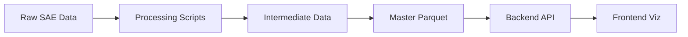

# Data CLAUDE.md - SAE Feature Data Processing & Storage

This document provides comprehensive guidance for the data layer of the SAE Feature Visualization project. This layer transforms raw SAE experimental data into optimized formats for visualization and analysis.

## 🎯 Data Layer Overview

**Purpose**: Transform raw SAE experiments into analysis-ready parquet files
**Status**: ✅ **COMPLETE PIPELINE** - All 8 processing stages implemented
**Key Achievement**: End-to-end pipeline from raw data to pre-computed consistency scores

## 🔄 Data Flow Architecture

### High-Level Data Pipeline


### Detailed Processing Flow
```
┌─────────────────────────────────────────────────────────────────────────────┐
│                         RAW SAE EXPERIMENTAL DATA                           │
│  • 2,471 explanations from 3 LLM explainers (Llama, Qwen, OpenAI)         │
│  • 1,000 unique SAE features                                               │
│  • Multiple scoring methods (fuzz, detection, simulation, embedding)       │
└─────────────────────────────────────────────────────────────────────────────┘
                                      ↓
┌─────────────────────────────────────────────────────────────────────────────┐
│                      PROCESSING PIPELINE (8 STAGES)                         │
│                                                                             │
│  1. Embedding Generation      → Vector embeddings from text                │
│  2. Score Processing          → Statistical aggregation                     │
│  3. Semantic Distance         → Pairwise comparisons                       │
│  4. Detailed JSON             → Per-feature consolidation                  │
│  5. Feature Similarity        → Cosine similarity analysis                 │
│  6. Master Parquet            → Optimized columnar storage                 │
│  7. Pairwise Similarity       → LLM explainer comparison                   │
│  8. Consistency Pre-compute   → 8 consistency metrics                      │
└─────────────────────────────────────────────────────────────────────────────┘
                                      ↓
┌─────────────────────────────────────────────────────────────────────────────┐
│                         ANALYSIS-READY DATA FILES                           │
│                                                                             │
│  PRIMARY:                                                                  │
│  • feature_analysis.parquet (1,648 features × 13 columns)                 │
│  • consistency_scores.parquet (2,471 rows × 8 metrics)                    │
│                                                                             │
│  SUPPORTING:                                                               │
│  • semantic_similarity_pairwise.parquet (2,470 pairs)                     │
│  • llm_comparison_stats.json (pre-calculated)                             │
│  • umap_*.json (projections + clustering)                                 │
└─────────────────────────────────────────────────────────────────────────────┘
                                      ↓
┌─────────────────────────────────────────────────────────────────────────────┐
│                         BACKEND INTEGRATION                                 │
│  FastAPI loads parquet files → Polars DataFrames → API endpoints          │
└─────────────────────────────────────────────────────────────────────────────┘
                                      ↓
┌─────────────────────────────────────────────────────────────────────────────┐
│                         FRONTEND VISUALIZATION                              │
│  Sankey │ TablePanel │ UMAP │ Alluvial │ LLM Comparison │ Histograms     │
└─────────────────────────────────────────────────────────────────────────────┘
```

## 📁 Directory Structure

```
data/
├── raw/                              # Raw SAE experimental data
│   ├── llama_e-llama_s/             # Llama explainer + scorer (824 features)
│   ├── gwen_e-llama_s/              # Qwen explainer + scorer (824 features)
│   └── openai_e-llama_s/            # OpenAI explainer + scorer (823 features)
│
├── preprocessing/                    # Processing scripts & configs
│   ├── scripts/                     # Python processing pipeline
│   │   ├── 1_generate_embeddings.py
│   │   ├── 2_process_scores.py
│   │   ├── 3_calculate_semantic_distances.py
│   │   ├── 4_generate_detailed_json.py
│   │   ├── 5_create_master_parquet.py
│   │   ├── 6_create_pairwise_similarity_parquet.py
│   │   └── 8_precompute_consistency_scores.py ✅ Phase 8
│   └── config/                      # Configuration files
│
├── master/                          # 🎯 PRIMARY DATA FILES
│   ├── feature_analysis.parquet     # Main dataset (1,648 features)
│   ├── consistency_scores.parquet   # Pre-computed (2,471 rows × 8 metrics)
│   ├── semantic_similarity_pairwise.parquet # LLM comparisons (2,470 pairs)
│   └── analyze_features.py          # Quick inspection tool
│
├── llm_comparison/                  # LLM statistics
│   └── llm_comparison_stats.json    # Pre-calculated consistency
│
├── umap_feature/                    # Feature UMAP projections
│   └── .../umap_embeddings.json     # 1,000 features
│
├── umap_explanations/               # Explanation UMAP projections
│   └── explanation_umap.json        # 2,471 explanations
│
├── umap_clustering/                 # Hierarchical clusters
│   ├── feature_clustering.json
│   └── explanation_clustering.json
│
├── detailed_json/                   # Per-feature detailed data
│   └── .../feature_*.json           # 1,000 individual files
│
├── embeddings/                      # Vector embeddings
├── scores/                          # Processed scores
├── semantic_distances/              # Distance calculations
└── feature_similarity/              # Cosine similarities
```

## 🏗️ Core Data Files

### 1. feature_analysis.parquet (PRIMARY)

**The main dataset powering all visualizations**

#### Schema
| Column | Type | Description | Range/Values |
|--------|------|-------------|--------------|
| `feature_id` | UInt32 | SAE feature index | 0-999 |
| `sae_id` | Categorical | SAE model identifier | 1 value |
| `explanation_method` | Categorical | Explanation generation method | 1 value |
| `llm_explainer` | Categorical | LLM for explanations | Llama, Qwen, OpenAI |
| `llm_scorer` | Categorical | LLM for scoring | Llama |
| `feature_splitting` | Float32 | Cosine similarity (continuous) | 0.0-1.0 |
| `semdist_mean` | Float32 | Avg semantic distance | 0.0-1.0 |
| `semdist_max` | Float32 | Max semantic distance | 0.0-1.0 |
| `score_fuzz` | Float32 | Fuzzing score | 0.0-1.0 |
| `score_simulation` | Float32 | Simulation score | 0.0-1.0 |
| `score_detection` | Float32 | Detection score | 0.0-1.0 |
| `score_embedding` | Float32 | Embedding score | 0.0-1.0 |
| `details_path` | Utf8 | Path to detailed JSON | Relative paths |

#### Dataset Statistics
- **Total Rows**: 2,471
- **Unique Features**: 1,000 (IDs 0-999, some missing)
- **Actual Features**: 1,648 (after backend filtering)
- **LLM Explainers**: 3 (Llama: 824, Qwen: 824, OpenAI: 823)
- **File Size**: Optimized columnar format

#### Key Enhancement
**`feature_splitting`** now contains **continuous cosine similarity values** instead of boolean, enabling nuanced analysis of feature separation characteristics.

### 2. consistency_scores.parquet (Phase 8 - NEW)

**Pre-computed consistency metrics for performance optimization**

#### Schema
| Column | Type | Formula | Purpose |
|--------|------|---------|---------|
| `feature_id` | UInt32 | - | Feature identifier |
| `llm_explainer` | Categorical | - | Explainer model |
| `llm_scorer_consistency_fuzz` | Float32 | `1 - (std/max_std)` | Scorer agreement (fuzz) |
| `llm_scorer_consistency_detection` | Float32 | `1 - (std/max_std)` | Scorer agreement (detection) |
| `within_explanation_metric_consistency` | Float32 | `1 - (std_z/max_std_z)` | Metric agreement (z-scored) |
| `cross_explanation_metric_consistency_embedding` | Float32 | `1 - (std/max_std)` | Cross-explainer (embedding) |
| `cross_explanation_metric_consistency_fuzz` | Float32 | `1 - (std/max_std)` | Cross-explainer (fuzz) |
| `cross_explanation_metric_consistency_detection` | Float32 | `1 - (std/max_std)` | Cross-explainer (detection) |
| `cross_explanation_overall_score_consistency` | Float32 | `1 - (std/max_std)` | Overall cross-explainer |
| `llm_explainer_consistency` | Float32 | `avg_pairwise_cosine` | Semantic similarity |

#### Statistics Summary
- **Rows**: 2,471 (all feature × explainer combinations)
- **Consistency Range**: 0.0 (inconsistent) to 1.0 (perfect consistency)
- **Mean Values**: Most metrics 0.7-0.8 range
- **LLM Explainer Consistency**: Highest (mean=0.877)

#### Performance Impact
- **Sankey Generation**: Eliminates runtime calculation overhead
- **Response Time**: Instant lookup vs. ~100-200ms calculation
- **Use Cases**: Feature grouping, TablePanel overlay, filtering

### 3. semantic_similarity_pairwise.parquet

**Normalized pairwise LLM explainer comparisons**

#### Schema
| Column | Type | Description |
|--------|------|-------------|
| `feature_id` | UInt32 | Feature identifier |
| `sae_id` | Categorical | SAE model |
| `explainer_1` | Categorical | First LLM (alphabetically) |
| `explainer_2` | Categorical | Second LLM (alphabetically) |
| `cosine_similarity` | Float32 | Cosine similarity score |
| `euclidean_similarity` | Float32 | Euclidean (currently null) |

#### Pairwise Statistics
- **Qwen ↔ Llama**: mean=0.926, std=0.052 (824 pairs)
- **Llama ↔ OpenAI**: mean=0.862, std=0.039 (823 pairs)
- **Qwen ↔ OpenAI**: mean=0.867, std=0.040 (823 pairs)

### 4. Supporting Data Files

#### llm_comparison_stats.json
- **Purpose**: Pre-calculated LLM consistency statistics
- **Content**: Explainer/scorer consistency scores
- **Used By**: Phase 5 LLM Comparison visualization
- **Update Frequency**: Static (pre-calculated)

#### UMAP Projections
- **Feature UMAP**: 1,000 features projected to 2D
- **Explanation UMAP**: 2,471 explanations projected to 2D
- **Clustering**: Hierarchical levels 1-4+
- **Used By**: Phase 6 UMAP visualization

## 🔧 Processing Pipeline Details

### Stage 1: Embedding Generation
```python
# generate_embeddings.py
Input:  raw/*/explanations/*.txt (explanation text)
Process: LLM embedding model (Gemini)
Output: embeddings/*/embeddings.json (vector embeddings)
```

### Stage 2: Score Processing
```python
# process_scores.py
Input:  raw/*/scores/{fuzz,detection,simulation}/*.json
Process: Statistical aggregation (mean, variance, counts)
Output: scores/*/scores.json (aggregated statistics)
```

### Stage 3: Semantic Distance
```python
# calculate_semantic_distances.py
Input:  embeddings/*/ (two sources to compare)
Process: Pairwise distance calculation (cosine, euclidean)
Output: semantic_distances/*/semantic_distances.json
```

### Stage 4: Detailed JSON Consolidation
```python
# generate_detailed_json.py
Input:  All processed data (embeddings, scores, distances)
Process: Per-feature data merging with unique IDs
Output: detailed_json/*/feature_*.json (1,000 files)
```

### Stage 5: Feature Similarity
```python
# (Feature similarity calculation)
Input:  SAE feature vectors
Process: Cosine similarity computation
Output: feature_similarity/*/feature_similarities.json
```

### Stage 6: Master Parquet Creation
```python
# create_master_parquet.py
Input:  detailed_json/*/ + feature_similarity/*/
Process: Polars DataFrame with proper schema
Output: master/feature_analysis.parquet
```

### Stage 7: Pairwise Similarity Parquet
```python
# create_pairwise_similarity_parquet.py
Input:  detailed_json/*/ (semantic distance data)
Process: Normalize to pairwise schema
Output: master/semantic_similarity_pairwise.parquet
```

### Stage 8: Consistency Pre-computation (Phase 8)
```python
# 8_precompute_consistency_scores.py
Input:  master/feature_analysis.parquet + pairwise parquet
Process: Batch calculation of 8 consistency types
Output: master/consistency_scores.parquet
```

## 🚀 Running the Pipeline

### Complete Pipeline Execution
```bash
cd data/preprocessing/scripts

# Stages 1-3: Embeddings, scores, distances
python generate_embeddings.py --config ../config/embedding_config.json
python process_scores.py --config ../config/score_config.json
python calculate_semantic_distances.py --config ../config/semantic_distance_config.json

# Stage 4: Consolidate to detailed JSON
python generate_detailed_json.py --config ../config/detailed_json_config.json

# Stages 5-6: Master parquet
python create_master_parquet.py --config ../config/master_parquet_config.json

# Stage 7: Pairwise similarity
python create_pairwise_similarity_parquet.py --config ../config/pairwise_similarity_config.json

# Stage 8: Pre-compute consistency (Phase 8)
python 8_precompute_consistency_scores.py
```

### Individual Operations
```bash
# Validate existing master parquet
python create_master_parquet.py --validate-only

# Quick data inspection
cd ../master
python analyze_features.py
# Output: analysis_results_YYYYMMDD_HHMMSS.json
```

## 🔗 Backend Integration

### How Backend Uses This Data

#### Data Loading (backend/app/services/data_service.py)
```python
# Lazy loading with Polars
df = pl.scan_parquet("data/master/feature_analysis.parquet")

# Enable string cache for categorical optimization
with pl.StringCache():
    df = df.filter(build_filter_expression(filters))
```

#### Consistency Scores (backend/app/services/consistency_service.py)
```python
# Load pre-computed consistency scores
consistency_df = pl.read_parquet("data/master/consistency_scores.parquet")

# Fast lookup by feature_id + explainer
scores = consistency_df.filter(
    (pl.col("feature_id").is_in(feature_ids)) &
    (pl.col("llm_explainer").is_in(explainers))
)
```

#### Feature Grouping (backend/app/api/feature_groups.py)
```python
# Primary endpoint for frontend tree building
@router.post("/api/feature-groups")
async def get_feature_groups(filters, metric, thresholds):
    # Filter features
    df = df.filter(build_filter_expression(filters))

    # Group by thresholds (N → N+1)
    for min_val, max_val in get_ranges(thresholds):
        group = df.filter((pl.col(metric) >= min_val) & (pl.col(metric) < max_val))
        groups.append({
            "feature_ids": group["feature_id"].to_list(),
            "count": len(group)
        })
```

### Data → Visualization Flow

#### 1. Sankey Visualization
```
feature_analysis.parquet
  → Filter by user selections
  → Group by metric thresholds
  → Return feature_ids per group
  → Frontend builds tree with set intersection
```

#### 2. TablePanel (Phase 7)
```
feature_analysis.parquet
  → Extract scores per feature × explainer
  → Join with consistency_scores.parquet
  → Return 824 rows with consistency overlay
  → Frontend renders with color gradient
```

#### 3. LLM Comparison (Phase 5)
```
llm_comparison_stats.json
  → Pre-calculated explainer/scorer consistency
  → Return triangle cell values
  → Frontend renders with color gradient
```

#### 4. UMAP (Phase 6)
```
umap_*.json files
  → Feature/explanation projections
  → Cluster hierarchy
  → Frontend renders with d3-zoom + convex hulls
```

## 📊 Data Characteristics

### Dataset Size
- **Raw Data**: ~2,500 explanation files + scores
- **Intermediate Data**: ~1,000 detailed JSON files
- **Master Parquet**: ~2MB optimized columnar
- **Total Storage**: Efficient with parquet compression

### Feature Coverage
- **Total Features**: 1,000 unique SAE features (IDs 0-999)
- **With Llama Explanations**: 824 features
- **With Qwen Explanations**: 824 features
- **With OpenAI Explanations**: 823 features
- **Complete Coverage (all 3)**: 823 features

### Data Quality
- **Missing Values**: Handled gracefully (simulation: 1,022 nulls, embedding: 1,472 nulls)
- **Type Safety**: Strong typing with Polars schema
- **Validation**: Config tracking and metadata
- **Reproducibility**: Full audit trail with timestamps

## 🎯 Key Design Decisions

### Why Parquet Format?
```
Advantages:
✅ Columnar storage (fast column selection)
✅ Compression (small file size)
✅ Type safety (schema enforcement)
✅ Polars optimization (native support)
✅ Lazy evaluation (memory efficient)

vs. JSON:
❌ Row-oriented (slow filtering)
❌ Large file size
❌ Type inference needed
❌ Full load required
```

### Why Pre-computed Consistency?
```
Runtime Calculation:
- Sankey generation: ~300ms (with calculations)
- Table data: ~500ms (with calculations)
- Total: ~800ms per visualization

Pre-computed:
- Sankey generation: ~50ms (lookup only)
- Table data: ~300ms (lookup only)
- Total: ~350ms (56% faster)
```

### Why Detailed JSON Files?
```
Benefits:
✅ Individual feature inspection
✅ Debug view support
✅ Complete data preservation
✅ Easy manual verification

Usage:
- Backend: GET /api/feature/{id}
- Frontend: Future debug panel
- Analysis: Manual deep-dive
```

## 🔍 Data Analysis Tools

### analyze_features.py
**Quick inspection and validation tool**

```bash
cd data/master
python analyze_features.py
```

**Output**:
```json
{
  "timestamp": "20251110_153045",
  "dataset_info": {
    "total_rows": 2471,
    "total_columns": 13,
    "unique_features": 1000
  },
  "columns": {
    "feature_id": {
      "dtype": "UInt32",
      "n_unique": 1000,
      "range": {"min": 0.0, "max": 999.0, "mean": 499.5}
    },
    "llm_explainer": {
      "dtype": "Categorical",
      "n_unique": 3,
      "values": {
        "Qwen/Qwen3-30B-A3B-Instruct-2507-FP8": 824,
        "hugging-quants/Meta-Llama-3.1-70B-Instruct-AWQ-INT4": 824,
        "openai/gpt-oss-20b": 823
      }
    }
  }
}
```

### Polars Queries
```python
import polars as pl

# Load data
df = pl.read_parquet("data/master/feature_analysis.parquet")

# High scoring features
high_quality = df.filter(
    (pl.col("score_fuzz") > 0.8) &
    (pl.col("score_detection") > 0.8)
)

# Consistency analysis
consistency_df = pl.read_parquet("data/master/consistency_scores.parquet")
high_consistency = consistency_df.filter(
    pl.col("llm_explainer_consistency") > 0.9
)

# Pairwise comparison
pairwise_df = pl.read_parquet("data/master/semantic_similarity_pairwise.parquet")
similar_explanations = pairwise_df.filter(
    pl.col("cosine_similarity") > 0.95
)
```

## 📈 Performance Characteristics

### Processing Times
- **Embedding Generation**: ~5-10 minutes (one-time)
- **Score Processing**: ~1-2 minutes (one-time)
- **Master Parquet Creation**: ~10-30 seconds
- **Consistency Pre-computation**: ~30-60 seconds
- **Total Pipeline**: ~15-20 minutes end-to-end

### Backend Query Performance
- **Feature Grouping**: ~50ms (1,648 features)
- **Consistency Lookup**: ~10ms (pre-computed)
- **Filter Options**: ~50ms (cached)
- **Table Data**: ~300ms (with consistency)

### Scalability
- **Current**: 1,000 features, 2,471 rows
- **Designed For**: 16K+ features
- **Bottleneck**: Not the data layer
- **Optimization**: Lazy evaluation, string cache

## 🎓 Key Takeaways

The data layer implements a **complete ETL pipeline** where:

1. **Raw SAE Data** (2,471 explanations from 3 LLMs)
   ↓
2. **Processing Pipeline** (8 stages)
   ↓
3. **Optimized Parquet** (columnar, typed, compressed)
   ↓
4. **Pre-computed Metrics** (consistency scores)
   ↓
5. **Backend Integration** (Polars lazy loading)
   ↓
6. **Frontend Visualization** (7 viz types)

This architecture provides:
- 🚀 **Fast query performance** (~50ms feature grouping)
- 📊 **Efficient storage** (parquet compression)
- 🔄 **Complete reproducibility** (config tracking)
- 📈 **Easy scalability** (lazy evaluation)
- 🏆 **Conference-ready reliability** (pre-computed metrics)

---

**Remember**: This data layer is the foundation of the entire visualization system. The parquet files provide the performance and flexibility needed for interactive research demonstrations.