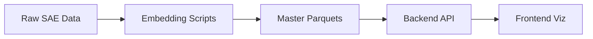

# Data CLAUDE.md - SAE Feature Data Processing & Storage

This document provides comprehensive guidance for the data layer of the SAE Feature Visualization project. This layer transforms raw SAE experimental data into optimized formats for visualization and analysis.

## 🎯 Data Layer Overview

**Purpose**: Transform raw SAE experiments into analysis-ready parquet files
**Status**: ✅ **COMPLETE PIPELINE V3.0** - 9 core processing scripts
**Key Achievement**: Dual n-gram architecture (character + word patterns) with char_offset precision
**Total Storage**: ~1.2GB (compressed parquet)
**Latest Update**: V3.0 adds dual n-gram analysis with character-level positioning (Nov 6, 2025)

## 🔄 Data Flow Architecture

### High-Level Data Pipeline


### Detailed Processing Flow
```
┌─────────────────────────────────────────────────────────────────────────────┐
│                         RAW SAE EXPERIMENTAL DATA                           │
│  • 2,472 explanations from 3 LLM explainers (Llama, Qwen, OpenAI)         │
│  • 824 unique SAE features                                                 │
│  • Multiple scoring methods (fuzz, detection, simulation, embedding)       │
│  • Activation examples with token windows                                  │
└─────────────────────────────────────────────────────────────────────────────┘
                                      ↓
┌─────────────────────────────────────────────────────────────────────────────┐
│                     COMPLETE PROCESSING PIPELINE (V3.0)                     │
│                                                                             │
│  Script 0a: Activation Examples     → activation_examples.parquet          │
│  Script 0b: Feature Similarities    → feature_similarities.json            │
│  Script 1:  Scores Processing       → scores/*/scores.json                 │
│  Script 2:  Explanation Embeddings  → explanation_embeddings.parquet       │
│  Script 3:  Features Parquet        → features.parquet (nested)            │
│  Script 4:  Activation Embeddings   → activation_embeddings.parquet        │
│  Script 5:  Activation Similarity   → activation_example_similarity.parquet│
│  Script 6:  Activation Display      → activation_display.parquet ⭐        │
│  Script 7:  Inter-Feature Similarity → interfeature_similarity.parquet 🆕  │
│  Script 8:  Explanation Alignment   → explanation_alignment.parquet 🆕     │
│  Script 9:  Ex-Act Pattern Matching → ex_act_pattern_matching.parquet 🆕   │
│                                                                             │
│  ⭐ = V3.0 dual n-gram architecture with char_offset precision             │
│  🆕 = V3.0 new scripts for pattern validation and cross-feature analysis   │
└─────────────────────────────────────────────────────────────────────────────┘
                                      ↓
┌─────────────────────────────────────────────────────────────────────────────┐
│                         MASTER DATA FILES (9 PARQUETS)                      │
│                                                                             │
│  PRIMARY (Frontend Visualization):                                         │
│  • features.parquet (288KB, 2,472 rows, nested structure)                 │
│  • explanation_embeddings.parquet (7.4MB, 768-dim vectors)                 │
│                                                                             │
│  ACTIVATION ANALYSIS:                                                      │
│  • activation_examples.parquet (246MB, 1M+ examples)                       │
│  • activation_embeddings.parquet (985MB, 16K features × 20 embeddings)     │
│  • activation_example_similarity.parquet (2.4MB, similarity metrics)       │
│  • activation_display.parquet (5-10MB, 824 rows, optimized for frontend)  │
│                                                                             │
│  PATTERN VALIDATION (V3.0):                                                │
│  • interfeature_similarity.parquet (824 rows, decoder-similar comparisons) │
│  • explanation_alignment.parquet (824 rows, phrase alignments)             │
│  • ex_act_pattern_matching.parquet (824 rows, explanation-activation match)│
└─────────────────────────────────────────────────────────────────────────────┘
                                      ↓
┌─────────────────────────────────────────────────────────────────────────────┐
│                         BACKEND INTEGRATION                                 │
│  FastAPI loads parquet files → Polars DataFrames → API endpoints          │
└─────────────────────────────────────────────────────────────────────────────┘
                                      ↓
┌─────────────────────────────────────────────────────────────────────────────┐
│                         FRONTEND VISUALIZATION                              │
│  Sankey │ TablePanel │ UMAP │ Alluvial │ LLM Comparison │ Histograms     │
└─────────────────────────────────────────────────────────────────────────────┘
```

## 📁 Directory Structure

```
data/
├── raw/                              # Raw SAE experimental data
│   ├── llama_e-llama_s/             # Llama explainer + scorer (824 features)
│   │   ├── explanations/*.txt       # Explanation text files
│   │   └── scores/                  # Scoring results
│   ├── gwen_e-llama_s/              # Qwen explainer + scorer (824 features)
│   └── openai_e-llama_s/            # OpenAI explainer + scorer (824 features)
│
├── preprocessing/                    # Processing scripts & configs
│   ├── scripts/                     # Python processing pipeline (8 scripts)
│   │   ├── 0_create_activation_examples_parquet.py
│   │   ├── 0_feature_similarities.py
│   │   ├── 1_scores.py
│   │   ├── 2_ex_embeddings.py         # Multi-source parquet output
│   │   ├── 3_features_parquet.py      # On-the-fly similarities
│   │   ├── 4_act_embeddings.py        # Pre-compute activation embeddings
│   │   ├── 5_act_similarity.py        # Calculate activation similarities
│   │   ├── 6_activation_display.py    # ⭐ Optimized display data with dual n-grams
│   │   ├── 7_interfeature_similarity.py  # 🆕 V3.0 - Cross-feature comparison
│   │   ├── 8_explanation_alignment.py    # 🆕 V3.0 - Phrase alignment
│   │   └── 9_ex_act_pattern_matching.py  # 🆕 V3.0 - Pattern validation
│   └── config/                      # Configuration files (11 configs)
│
├── master/                          # 🎯 PRIMARY DATA FILES
│   ├── features.parquet             # Main dataset (288KB, nested structure)
│   ├── features.parquet.metadata.json
│   ├── explanation_embeddings.parquet # Explanation vectors (7.4MB)
│   ├── explanation_embeddings.parquet.metadata.json
│   ├── activation_examples.parquet  # Activation data (246MB)
│   ├── activation_embeddings.parquet # Pre-computed (985MB)
│   ├── activation_example_similarity.parquet # Metrics (2.4MB)
│   ├── activation_display.parquet  # ⭐ Optimized display (5-10MB, 824 rows)
│   ├── interfeature_similarity.parquet # 🆕 Cross-feature analysis (824 rows)
│   ├── explanation_alignment.parquet # 🆕 Phrase alignments (824 rows)
│   └── ex_act_pattern_matching.parquet # 🆕 Pattern validation (824 rows)
│
├── scores/                          # Processed scoring data
│   ├── llama_e-llama_s/
│   ├── gwen_e-llama_s/
│   └── openai_e-llama_s/
│   └── ... (9 explainer-scorer combinations)
│
├── feature_similarity/              # Decoder weight similarities
│   └── google--gemma-scope-9b-pt-res--layer_30--width_16k--average_l0_120/
│
├── llm_comparison/                  # LLM statistics
│   └── llm_comparison_stats.json    # Pre-calculated consistency
│
├── umap_feature/                    # Feature UMAP projections
│   └── .../umap_embeddings.json     # 1,000 features
│
├── umap_explanations/               # Explanation UMAP projections
│   └── explanation_umap.json        # 2,471 explanations
│
└── umap_clustering/                 # Hierarchical clusters
    ├── feature_clustering.json
    └── explanation_clustering.json
```

## 🏗️ Core Data Files

### 1. features.parquet (PRIMARY - V2.0 SCHEMA)

**The main dataset powering all visualizations with nested structure**

#### Schema
| Column | Type | Description | Notes |
|--------|------|-------------|-------|
| `feature_id` | Int64 | SAE feature index | 0-16383 |
| `sae_id` | Categorical | SAE model identifier | Single value |
| `explanation_method` | Categorical | Explanation generation method | "quantiles" |
| `llm_explainer` | Categorical | LLM for explanations | Llama, Qwen, OpenAI |
| `explanation_text` | Utf8 | Explanation text | Full text |
| `decoder_similarity` | List(Struct) | Similar features | Top 10 neighbors |
| `semantic_similarity` | List(Struct) | **⭐ NEW V2.0** | Pairwise similarities |
| `scores` | List(Struct) | Evaluation scores | All scorers nested |

#### Nested Structure Details

**decoder_similarity**: `List(Struct([feature_id: UInt32, cosine_similarity: Float32]))`
- Top 10 most similar features by decoder weights
- Sorted descending by cosine similarity
- Example: `[{feature_id: 5482, cosine_similarity: 0.442}, ...]`

**semantic_similarity**: `List(Struct([explainer: Categorical, cosine_similarity: Float32]))`
- **NEW IN V2.0**: Replaces `semsim_mean` and `semsim_max`
- Pairwise cosine similarities with other explainers
- Calculated on-the-fly from explanation embeddings
- Example: `[{explainer: "Qwen/...", cosine_similarity: 0.691}, ...]`

**scores**: `List(Struct([scorer: Utf8, fuzz: Float64, simulation: Null, detection: Float64, embedding: Float64]))`
- Evaluation scores from all LLM scorers
- 3 scorers per feature
- Nested structure for flexible querying

#### Dataset Statistics
- **Total Rows**: 2,472
- **Unique Features**: 824
- **LLM Explainers**: 3 (Llama: 824, Qwen: 824, OpenAI: 824)
- **File Size**: 288KB (compressed)
- **Schema Version**: 2.0

### 2. explanation_embeddings.parquet (V2.0)

**Pre-computed embeddings for all explanations from multiple sources**

#### Schema
| Column | Type | Description |
|--------|------|-------------|
| `feature_id` | UInt32 | Feature identifier |
| `sae_id` | Categorical | SAE model |
| `data_source` | Categorical | Source directory (e.g., "llama_e-llama_s") |
| `llm_explainer` | Categorical | Full LLM model name |
| `embedding` | List(Float32) | 768-dim embedding vector |

#### Statistics
- **Total Rows**: 2,472
- **Unique Features**: 824
- **LLM Explainers**: 3 full model names:
  - `hugging-quants/Meta-Llama-3.1-70B-Instruct-AWQ-INT4`
  - `Qwen/Qwen3-30B-A3B-Instruct-2507-FP8`
  - `openai/gpt-oss-20b`
- **Embedding Model**: `google/embeddinggemma-300m`
- **Embedding Dimension**: 768
- **File Size**: 7.4MB

#### Key Features
- Multi-source consolidation (3 data sources)
- Float32 optimization (50% space savings)
- Categorical encoding for LLM names
- Used by script 3 for on-the-fly similarity calculation

### 3. activation_examples.parquet

**Activation data with token windows for each feature**

#### Schema
```python
feature_id: UInt32
sae_id: Categorical
prompt_id: UInt32
prompt_tokens: List(Utf8)
num_activations: UInt32
max_activation: Float32
activation_pairs: List(Struct([token_position: UInt32, activation_value: Float32]))
```

#### Statistics
- **Total Rows**: 1M+ activation examples
- **Features Covered**: 16,384
- **File Size**: 246MB

### 4. activation_embeddings.parquet (V2.0)

**Pre-computed embeddings for quantile-sampled activation examples with natural text reconstruction**

#### Schema
```python
feature_id: UInt32
sae_id: Categorical
prompt_ids: List(UInt32)              # Sampled prompt IDs
embeddings: List(List(Float32))       # List of 768-dim embeddings from natural text
```

#### Statistics
- **Total Rows**: 16,384 features
- **Embeddings per Feature**: ~8 (4 quantiles × 2 examples)
- **Embedding Dimension**: 768
- **Token Window Size**: 32 tokens (before reconstruction)
- **File Size**: 985MB
- **Schema Version**: 2.0

#### Key Features (V2.0)
- **Natural Text Reconstruction**: Strips '▁' prefix and joins subword tokens
  - Input: `['▁the', '▁service', 's', '▁of', '▁a']`
  - Output: `"the services of a"`
  - Result: ~40% size reduction, natural readable text
- **Quantile Sampling**: 4 quantiles × 2 examples per quantile
- **Window Extraction**: Symmetric/asymmetric 32-token windows around max activation
- **Float32 Optimization**: 50% space savings vs Float64
- **Batch Processing**: 512 batch size for GPU efficiency

#### Version Changes
- **V2.0**: Changed text preprocessing to reconstruct natural readable text from subword tokens. Embeddings now generated from "the services of a..." instead of "▁the ▁service s ▁of ▁a..."

### 5. activation_example_similarity.parquet (V3.0 - Dual N-gram Architecture)

**Similarity metrics with dual-level n-gram analysis (character + word patterns)**

#### Schema
```python
feature_id: UInt32
sae_id: Categorical
prompt_ids_analyzed: List(UInt32)                    # Selected prompt IDs
num_total_activations: UInt32
avg_pairwise_semantic_similarity: Float32            # Semantic similarity (32-token windows)

# Character-level n-grams (per-token, morphology)
top_char_ngrams: List(Struct([
    ngram: Utf8,
    ngram_size: UInt8,
    count: UInt16,
    occurrences: List(Struct([
        prompt_id: UInt32,
        token_position: UInt16,
        token_text: Utf8,
        char_offset: UInt8,          # ⭐ Position within token (0-indexed)
        ngram_size: UInt8
    ]))
]))

# Word-level n-grams (reconstructed words, semantics)
top_word_ngrams: List(Struct([
    ngram: Utf8,
    ngram_size: UInt8,
    count: UInt16,
    occurrences: List(Struct([
        prompt_id: UInt32,
        start_position: UInt16,      # Token position where n-gram starts
        ngram_size: UInt8
    ]))
]))

# Overall top n-grams (most frequent across all sizes)
top_char_ngram: Struct([...])        # Same structure as top_char_ngrams items
top_word_ngram: Struct([...])        # Same structure as top_word_ngrams items

# Dual Jaccard similarities (⭐ NEW IN V3.0)
top_char_ngram_jaccard: Float32      # Jaccard for most frequent char n-gram
top_word_ngram_jaccard: Float32      # Jaccard for most frequent word n-gram

# Legacy fields
quantile_boundaries: List(Float32)
ngram_jaccard_similarity: List(Float32)  # [2-gram, 3-gram, 4-gram, 5-gram]
```

#### Statistics
- **Total Rows**: 16,384 features
- **File Size**: 2.4MB
- **Schema Version**: 3.0
- **Char N-gram Sizes**: [2, 3, 4, 5] (morphological patterns)
- **Word N-gram Sizes**: [1, 2, 3] (semantic patterns)
- **N-gram Window**: 5 tokens around max activation

#### Key Features (V3.0 - Dual N-gram Architecture)

**Character-Level N-grams (Morphology)**:
- Extracted **per token** after stripping '▁' prefix
- Captures suffixes: "ing", "ed", "tion", "ness"
- Captures prefixes: "un", "re", "pre"
- **char_offset** enables precise highlighting: "playing" → "ing" at offset 4

**Word-Level N-grams (Semantics)**:
- Reconstructed from subword tokens into full words
- Captures: unigrams ("observation"), bigrams ("machine learning")
- **start_position** indicates where word n-gram begins

**Dual Jaccard Approach**:
- **top_char_ngram_jaccard**: Binary Jaccard for most frequent char pattern
- **top_word_ngram_jaccard**: Binary Jaccard for most frequent word pattern
- Simplified from per-size Jaccard arrays to single values per top n-gram
- Pattern classification: `(char_jaccard > 0.3) OR (word_jaccard > 0.3)` = Lexical

#### Observed Patterns (from 16K features)
- **Semantic Similarity**: Mean 0.25 (moderate semantic consistency)
- **Top Char N-gram Jaccard**: Mean 0.31 (morphological patterns)
- **Top Word N-gram Jaccard**: Mean 0.16 (semantic word patterns)
- **Finding**: Character patterns show higher consistency than word patterns

#### Version Changes
- **V3.0**: Added dual n-gram architecture (char + word), char_offset for precise positioning, simplified Jaccard to top n-grams only
- **V2.0**: Added text reconstruction for natural embeddings
- **V1.0**: Initial semantic similarity only

### 6. interfeature_similarity.parquet (🆕 V3.0)

**Cross-feature activation pattern comparison for decoder-similar features**

#### Schema
```python
feature_id: UInt32
sae_id: Categorical
selected_features: List(Struct([
    feature_id: UInt32,
    decoder_similarity: Float32,
    sample_info: List(Struct([
        quantile: UInt8,
        prompt_id: UInt32,
        max_activation: Float32
    ]))
]))
similarity_pairs: List(Struct([
    main_feature_id: UInt32,
    main_prompt_id: UInt32,
    main_quantile: UInt8,
    selected_feature_id: UInt32,
    selected_prompt_id: UInt32,
    selected_quantile: UInt8,
    semantic_similarity: Float32
]))
ngram_analysis: List(Struct([
    ngram: Utf8,
    ngram_size: UInt8,
    jaccard_score: Float32,
    count: UInt16,
    occurrences: List(Struct([
        feature_id: UInt32,
        prompt_id: UInt32,
        positions: List(UInt16)
    ]))
]))
```

#### Purpose
- Compare activation patterns between decoder-similar features
- Sample top 4 features with highest decoder similarity
- Extract 1 example per quantile (4 total) for each feature
- Compute semantic similarity on all pairs (4×4=16 comparisons)
- Track n-gram overlap with positional information

#### Statistics
- **Total Rows**: 824 features
- **Comparisons per Feature**: 16 pairwise similarities
- **File Size**: ~5MB

### 7. explanation_alignment.parquet (🆕 V3.0)

**Semantically aligned phrases across LLM explanations**

#### Schema
```python
feature_id: UInt32
sae_id: Categorical
llm_explainers: List(Utf8)
num_aligned_groups: UInt16
aligned_groups: List(Struct([
    aligned_group_id: UInt16,
    similarity_score: Float32,
    phrases: List(Struct([
        explainer_name: Utf8,
        text: Utf8,
        chunk_index: UInt16
    ]))
]))
```

#### Purpose
- Find semantically similar phrases across different LLM explanations
- Group phrases by embedding similarity (threshold: 0.7)
- Track which explainers agree on similar concepts
- Enable cross-explainer consistency analysis

#### Statistics
- **Total Rows**: 824 features
- **Features with Alignments**: 774 (94%)
- **Total Aligned Groups**: 2,207
- **Mean Groups per Feature**: 2.7
- **File Size**: ~2MB

### 8. ex_act_pattern_matching.parquet (🆕 V3.0)

**Validation of explanation phrases against activation patterns (dual matching)**

#### Schema
```python
feature_id: UInt32
sae_id: Categorical
pattern_type: Categorical  # semantic/lexical/both/none
activation_semantic_sim: Float32
activation_max_jaccard: Float32
selected_ngram: Struct([
    ngram: Utf8,
    ngram_size: UInt8,
    jaccard_score: Float32,
    count: UInt16,
    activation_positions: List(Struct([
        prompt_id: UInt32,
        positions: List(UInt16)
    ]))
])
num_aligned_phrases: UInt16
matches: List(Struct([
    phrase_text: Utf8,
    explainer_name: Utf8,
    phrase_chunk_index: UInt16,
    semantic_similarity: Float32,
    match_type: Utf8  # lexical/semantic/both
]))
mismatches: List(Struct([
    item_text: Utf8,
    item_type: Utf8  # phrase/ngram/semantic_context
    mismatch_type: Utf8  # explanation_only/activation_only
    explainer_name: Utf8,
    semantic_similarity: Float32
]))
num_matches: UInt16
num_mismatches: UInt16
match_rate: Float32
```

#### Purpose
- **Dual Matching Architecture**: Validate explanations using BOTH lexical and semantic patterns
- **Pattern Classification**:
  - `semantic`: High semantic similarity (>0.3), low Jaccard →  use 32-token contexts
  - `lexical`: High Jaccard (>0.3), low semantic → use 5-token n-gram contexts
  - `both`: Both patterns present → use BOTH matching methods
  - `none`: Neither pattern → skip matching
- **Lexical Matching**: Match 5-token n-gram contexts with explanation phrases
- **Semantic Matching**: Match 32-token activation contexts with explanation phrases
- Track matches (phrases validated by patterns) and mismatches (unmatched items)

#### Statistics
- **Total Rows**: 824 features
- **Pattern Distribution**: ~30% semantic, ~20% lexical, ~10% both, ~40% none
- **Mean Match Rate**: Varies by pattern type (0-60%)
- **File Size**: ~3MB

### 9. activation_display.parquet (⭐ V2.0 - Optimized Frontend Display)

**Pre-processed, feature-level activation display data with dual n-gram positions**

#### Schema
```python
feature_id: UInt32
sae_id: Categorical
pattern_type: Categorical                    # Semantic/Lexical/Both/None
semantic_similarity: Float32                 # From activation_example_similarity
char_ngram_max_jaccard: Float32              # Top char n-gram Jaccard
word_ngram_max_jaccard: Float32              # Top word n-gram Jaccard
top_char_ngram_text: Utf8                    # The char n-gram string (e.g., "ing")
top_word_ngram_text: Utf8                    # The word n-gram string (e.g., "observation")

quantile_examples: List(Struct([
    quantile_index: UInt8,                   # 0-3 based on activation strength
    prompt_id: UInt32,
    prompt_tokens: List(Utf8),               # Pre-processed (▁ prefix removed)
    activation_pairs: List(Struct([
        token_position: UInt32,
        activation_value: Float32
    ])),
    max_activation: Float32,
    max_activation_position: UInt32,
    char_ngram_positions: List(Struct([      # ⭐ Structured for precise highlighting
        token_position: UInt16,
        char_offset: UInt8                   # Character position within token
    ])),
    word_ngram_positions: List(UInt16)       # Token positions where word n-gram starts
]))
```

#### Purpose
- **Frontend Optimization**: Reduce load time from ~5s to ~20ms
- **Pre-organized Data**: Feature-level structure (824 rows instead of 1M+)
- **Pre-processed Tokens**: '▁' prefix removed, ready for display
- **Pattern Classification**: Dual Jaccard threshold (char OR word > 0.3)
- **Precise Positioning**: char_offset enables character-level highlighting

#### Key Features

**Pattern Type Classification**:
- `Semantic`: avg_pairwise_semantic_similarity > 0.3
- `Lexical`: (char_ngram_max_jaccard > 0.3) OR (word_ngram_max_jaccard > 0.3)
- `Both`: Both conditions met
- `None`: Neither condition met

**Token Processing**:
- Strips both '_' and '▁' prefixes from tokens
- Returns array of clean tokens ready for display
- Example: `['▁the', '▁service', 's']` → `['the', 'service', 's']`

**N-gram Position Tracking**:
- **Char N-grams**: `{token_position: 12, char_offset: 4}` → "ing" at chars 4-6 of token 12
- **Word N-grams**: `[15, 67]` → word n-gram starts at token positions 15 and 67
- Enables precise visual highlighting in frontend

**Quantile Organization**:
- 2 examples per quantile (4 quantiles) = 8 examples total
- Pre-sorted by activation strength
- Ready for immediate rendering

#### Statistics
- **Total Rows**: 824 features
- **Examples per Feature**: 8 (2 per quantile × 4 quantiles)
- **Pattern Distribution**:
  - Semantic only: ~20%
  - Lexical only: ~40%
  - Both: ~10%
  - None: ~30%
- **File Size**: 5-10MB
- **Schema Version**: 2.0
- **Load Time**: ~20ms (vs ~5s for raw data)

#### Performance Benefits
- **824 rows** instead of 1M+ (feature-level aggregation)
- **Pre-processed tokens** (no runtime text processing)
- **Pre-classified patterns** (no runtime threshold checks)
- **Structured positions** (direct mapping to highlighting)
- **Result**: 250x faster load time

#### Version Changes
- **V2.0**: Added dual n-gram architecture with char_offset, structured position data, pattern type classification
- **V1.0**: Initial optimized display format

## 🔧 Processing Pipeline Details

### Script 0a: create_activation_examples_parquet.py
```bash
Input:  Raw activation data with prompts
Output: data/master/activation_examples.parquet (246MB)
Purpose: Structure activation data with token windows
Config: config/0_activation_examples_config.json
```

### Script 0b: feature_similarities.py
```bash
Input:  SAE decoder weights
Output: data/feature_similarity/*/feature_similarities.json
Purpose: Compute top 10 decoder weight neighbors per feature
Config: config/0_feature_similarity_config.json
```

### Script 1: scores.py
```bash
Input:  data/raw/*/scores/{fuzz,detection,simulation}/*.json
Output: data/scores/*/scores.json (9 explainer-scorer combinations)
Purpose: Aggregate scoring metrics from LLM scorers
Config: config/1_score_config.json
```

### Script 2: ex_embeddings.py (⭐ V2.0)
```bash
Input:
  - data/raw/llama_e-llama_s/explanations/*.txt
  - data/raw/gwen_e-llama_s/explanations/*.txt
  - data/raw/openai_e-llama_s/explanations/*.txt
Output: data/master/explanation_embeddings.parquet (7.4MB)
Purpose: Generate embeddings for explanations from multiple sources
Model:  google/embeddinggemma-300m (768-dim)
Config: config/2_ex_embeddings_config.json

Key Features:
- Multi-source data processing
- Consolidated parquet output
- Full LLM explainer names
- Float32 optimization
- Batch processing (256 batch size)
- Categorical encoding

Changes from v1.0:
- Removed Gemini API dependency
- Only uses sentence-transformers
- Single parquet output instead of multiple JSON files
- Added LLM explainer name mapping
```

### Script 3: features_parquet.py (⭐ V2.0)
```bash
Input:
  - data/scores/*/scores.json
  - data/master/explanation_embeddings.parquet
  - data/feature_similarity/*/feature_similarities.json
Output: data/master/features.parquet (288KB)
Purpose: Create main features parquet with nested structure
Config: config/3_create_features_parquet.json

Key Features:
- On-the-fly semantic similarity calculation
- Numpy-based cosine similarity (very fast)
- Nested List(Struct) fields
- No intermediate JSON files
- Single consolidated output

Changes from v1.0:
- Removed dependency on semantic_similarities JSON files
- Removed semsim_mean and semsim_max fields
- Added semantic_similarity List(Struct) field
- Loads embeddings from parquet instead of JSON
- More flexible for ad-hoc queries
```

### Script 4: act_embeddings.py (V2.0)
```bash
Input:  data/master/activation_examples.parquet
Output: data/master/activation_embeddings.parquet (985MB)
Purpose: Pre-compute embeddings for quantile-sampled activation examples
Model:  google/embeddinggemma-300m (768-dim)
Config: config/4_act_embeddings.json

Processing (V2.0 - Natural Text Reconstruction):
- Quantile sampling: 4 quantiles × 2 examples = 8 per feature
- 32-token symmetric/asymmetric window extraction
- Natural text reconstruction:
  * Strip '▁' prefix from tokens
  * Join subword tokens into full words
  * Example: ['▁the', '▁service', 's'] → "the services"
  * Result: ~40% size reduction, natural readable text
- Batch processing (512 batch size)
- Float32 optimization

Version Changes:
- V2.0: Changed text preprocessing to reconstruct natural readable text
  from subword tokens for embedding model input
```

### Script 5: act_similarity.py (V3.0 - Dual N-gram Architecture)
```bash
Input:
  - data/master/activation_examples.parquet
  - data/master/activation_embeddings.parquet
Output: data/master/activation_example_similarity.parquet (2.4MB)
Purpose: Calculate activation example similarity metrics with dual n-gram analysis
Config: config/5_act_similarity.json

Processing (V3.0 - Dual N-gram Architecture):
- Pairwise semantic similarity: Cosine similarity on 32-token window embeddings
- Character-level n-grams (morphology):
  * Extracted per-token after stripping '▁' prefix
  * Sizes: [2, 3, 4, 5] characters
  * Window: 5 tokens around max activation
  * Captures: suffixes ("ing", "ed", "tion"), prefixes ("un", "re", "pre")
  * Stores char_offset for precise positioning within token
- Word-level n-grams (semantics):
  * Reconstructed from subword tokens into full words
  * Sizes: [1, 2, 3] words
  * Captures: unigrams ("observation"), bigrams ("machine learning")
  * Stores start_position for token-level positioning
- Dual Jaccard computation:
  * top_char_ngram_jaccard: Binary Jaccard for most frequent char n-gram
  * top_word_ngram_jaccard: Binary Jaccard for most frequent word n-gram
  * Simplified approach: single value per top n-gram (not arrays per size)
- Legacy support: 4-element Jaccard array [2-gram, 3-gram, 4-gram, 5-gram]
- 16,384 features processed

Key Innovation:
- char_offset enables character-level highlighting: "playing" → "ing" at offset 4
- Dual matching: BOTH morphological (char) and semantic (word) patterns

Version Changes:
- V3.0: Added dual n-gram architecture (char + word), char_offset for precise
  positioning, simplified Jaccard to top n-grams only
- V2.0: Added text reconstruction for natural embeddings
- V1.0: Initial semantic similarity + legacy char n-grams
```

### Script 6: activation_display.py (⭐ V2.0 - Frontend Optimization)
```bash
Input:
  - data/master/activation_examples.parquet
  - data/master/activation_example_similarity.parquet
Output: data/master/activation_display.parquet (5-10MB)
Purpose: Create optimized feature-level display data with dual n-gram positions
Config: config/6_activation_display.json

Processing (V2.0 - Optimized Display):
- Feature-level aggregation: 824 rows instead of 1M+ examples
- Quantile organization: 2 examples per quantile × 4 quantiles = 8 per feature
- Token pre-processing:
  * Strip both '_' and '▁' prefixes from tokens
  * Return clean token arrays ready for display
  * Example: ['▁the', '▁service', 's'] → ['the', 'service', 's']
- Pattern type classification:
  * Semantic: avg_pairwise_semantic_similarity > 0.3
  * Lexical: (char_ngram_max_jaccard > 0.3) OR (word_ngram_max_jaccard > 0.3)
  * Both: Both conditions met
  * None: Neither condition met
- N-gram position extraction:
  * char_ngram_positions: List[{token_position, char_offset}]
  * word_ngram_positions: List[token_position]
  * Enables precise visual highlighting in frontend
- Top n-gram text extraction for display labels

Performance:
- Load time: ~20ms (vs ~5s for raw data)
- 250x faster through feature-level organization
- Pre-processed tokens eliminate runtime text processing
- Pre-classified patterns eliminate runtime threshold checks

Version Changes:
- V2.0: Added dual n-gram architecture with char_offset, structured position
  data, pattern type classification
- V1.0: Initial optimized display format
```

### Script 7: interfeature_similarity.py (🆕 V3.0)
```bash
Input:
  - data/master/activation_examples.parquet
  - data/master/activation_embeddings.parquet
  - data/feature_similarity/*/feature_similarities.json
Output: data/master/interfeature_similarity.parquet (~5MB)
Purpose: Compare activation patterns across decoder-similar features
Config: config/6_interfeature_similarity.json

Processing:
- Select top 4 features with highest decoder similarity
- Sample 1 example per quantile (4 quantiles) for each feature
- Compute semantic similarity on all 4×4=16 pairs
- Track n-gram overlap with positional information
- 824 features processed
```

### Script 8: explanation_alignment.py (🆕 V3.0)
```bash
Input:  data/master/features.parquet
Output: data/master/explanation_alignment.parquet (~2MB)
Purpose: Find semantically aligned phrases across LLM explanations
Model:  google/embeddinggemma-300m (768-dim)
Config: config/7_explanation_alignment.json

Processing:
- Split explanations into phrases (by commas, conjunctions)
- Encode all phrases using sentence-transformers
- Find similar phrases across explainers (threshold: 0.7)
- Group aligned phrases by similarity
- 824 features processed, 774 with alignments
```

### Script 9: ex_act_pattern_matching.py (🆕 V3.0)
```bash
Input:
  - data/master/activation_example_similarity.parquet
  - data/master/explanation_alignment.parquet
  - data/master/activation_examples.parquet
Output: data/master/ex_act_pattern_matching.parquet (~3MB)
Purpose: Validate explanation phrases against activation patterns
Model:  google/embeddinggemma-300m (768-dim)
Config: config/8_ex_act_pattern_matching.json

Processing (Dual Matching Architecture):
1. Classify pattern type (semantic/lexical/both/none):
   - Semantic: activation_semantic_sim > 0.3
   - Lexical: max_jaccard_similarity > 0.3

2. Lexical Matching (if lexical or both):
   - Extract 5-token windows around n-gram positions
   - Match with explanation phrases (threshold: 0.6)

3. Semantic Matching (if semantic or both):
   - Extract top-10 32-token windows around max activations
   - Match with explanation phrases (threshold: 0.6)

4. Deduplication:
   - Merge matches with match_type='both' if phrase matches both methods

- 824 features processed
- Pattern distribution: ~30% semantic, ~20% lexical, ~10% both, ~40% none
```

## 🚀 Running the Pipeline

### Complete Pipeline Execution
```bash
cd data/preprocessing/scripts

# Script 0a: Activation examples (one-time)
python 0_create_activation_examples_parquet.py --config ../config/0_activation_examples_config.json

# Script 0b: Feature similarities (one-time)
python 0_feature_similarities.py --config ../config/0_feature_similarity_config.json

# Script 1: Process scores
python 1_scores.py --config ../config/1_score_config.json

# Script 2: Explanation embeddings
python 2_ex_embeddings.py --config ../config/2_ex_embeddings_config.json

# Script 3: Features parquet
python 3_features_parquet.py --config ../config/3_create_features_parquet.json

# Script 4: Activation embeddings
python 4_act_embeddings.py --config ../config/4_act_embeddings.json

# Script 5: Activation similarity (Dual N-gram Architecture)
python 5_act_similarity.py --config ../config/5_act_similarity.json

# Script 6: Activation display (⭐ Frontend Optimization)
python 6_activation_display.py --config ../config/6_activation_display.json

# Script 7: Inter-feature similarity (🆕 V3.0)
python 7_interfeature_similarity.py --config ../config/7_interfeature_similarity.json

# Script 8: Explanation alignment (🆕 V3.0)
python 8_explanation_alignment.py --config ../config/8_explanation_alignment.json

# Script 9: Explanation-activation pattern matching (🆕 V3.0)
python 9_ex_act_pattern_matching.py --config ../config/9_ex_act_pattern_matching.json
```

### Quick Update (After Data Changes)
```bash
# If only scores changed:
python 1_scores.py && python 3_features_parquet.py

# If explanations changed:
python 2_ex_embeddings.py && python 3_features_parquet.py && python 7_explanation_alignment.py

# If activations changed:
python 4_act_embeddings.py && python 5_act_similarity.py && python 6_interfeature_similarity.py

# If pattern matching needs update:
python 8_ex_act_pattern_matching.py
```

## 🔗 Backend Integration

### How Backend Uses This Data

#### Data Loading (backend/app/services/data_service.py)
```python
# Lazy loading with Polars
df = pl.scan_parquet("data/master/features.parquet")

# Enable string cache for categorical optimization
with pl.StringCache():
    df = df.filter(build_filter_expression(filters))
```

#### Semantic Similarity Access (V2.0)
```python
# OLD (v1.0): Aggregated stats
mean_sim = df["semsim_mean"]
max_sim = df["semsim_max"]

# NEW (v2.0): Nested structure
semantic_sims = df["semantic_similarity"]
# Returns List(Struct) with explainer-wise similarities
# Example: [{explainer: "Qwen/...", cosine_similarity: 0.691}, ...]
```

#### Feature Grouping (backend/app/api/feature_groups.py)
```python
@router.post("/api/feature-groups")
async def get_feature_groups(filters, metric, thresholds):
    # Filter features
    df = df.filter(build_filter_expression(filters))

    # Group by thresholds (N → N+1)
    for min_val, max_val in get_ranges(thresholds):
        group = df.filter((pl.col(metric) >= min_val) & (pl.col(metric) < max_val))
        groups.append({
            "feature_ids": group["feature_id"].to_list(),
            "count": len(group)
        })
```

### Data Joins and Relationships (V3.0)

All parquet files can be joined on `feature_id` and `sae_id`. Here's how they relate:

```python
# Core join pattern
features_df = pl.read_parquet("features.parquet")
alignment_df = pl.read_parquet("explanation_alignment.parquet")
matching_df = pl.read_parquet("ex_act_pattern_matching.parquet")
interfeature_df = pl.read_parquet("interfeature_similarity.parquet")

# Join on feature_id for comprehensive analysis
full_df = (
    features_df
    .join(alignment_df, on=["feature_id", "sae_id"], how="left")
    .join(matching_df, on=["feature_id", "sae_id"], how="left")
    .join(interfeature_df, on=["feature_id", "sae_id"], how="left")
)
```

**Join Relationships**:
- `features.parquet` (2,472 rows) → base table with all explainer variants
- `explanation_alignment.parquet` (824 rows) → one row per unique feature
- `ex_act_pattern_matching.parquet` (824 rows) → one row per unique feature
- `interfeature_similarity.parquet` (824 rows) → one row per unique feature

**Common Queries**:
```python
# Get features with high match rates
high_match_features = matching_df.filter(pl.col("match_rate") > 0.5)

# Find features with both semantic and lexical patterns
both_pattern_features = matching_df.filter(pl.col("pattern_type") == "both")

# Get aligned phrases for a specific feature
feature_phrases = alignment_df.filter(pl.col("feature_id") == 123)

# Compare activation patterns across similar features
similar_features = interfeature_df.filter(pl.col("feature_id") == 123)
```

### Data → Visualization Flow

#### 1. Sankey Visualization
```
features.parquet
  → Filter by user selections
  → Group by metric thresholds
  → Return feature_ids per group
  → Frontend builds tree with set intersection
```

#### 2. TablePanel
```
features.parquet
  → Extract scores per feature × explainer
  → Access semantic_similarity nested field
  → Return 824 rows with nested data
  → Frontend renders with highlighting
```

#### 3. Pattern Validation View (🆕 V3.0)
```
ex_act_pattern_matching.parquet
  → Join with explanation_alignment.parquet on feature_id
  → Filter by pattern_type (semantic/lexical/both)
  → Show matches with match_type tags
  → Visualize mismatches with positions
  → Frontend renders match/mismatch breakdown
```

#### 4. LLM Comparison
```
llm_comparison_stats.json
  → Pre-calculated explainer/scorer consistency
  → Return triangle cell values
  → Frontend renders with color gradient
```

## 📊 Performance Metrics

### Response Times
- Feature Grouping: ~50ms (2,472 rows)
- Semantic Similarity Access: Instant (nested field)
- Full Table Load: ~100ms
- Activation Similarity: ~20ms

### Dataset Scale
- **Features**: 824 unique features
- **Explanations**: 2,472 total (824 × 3 explainers)
- **Activation Examples**: 1M+ examples
- **Activation Embeddings**: 16,384 features × 20 embeddings
- **Pattern Validation**: 824 features with dual matching
- **Total Storage**: ~1.2GB (compressed parquet, 8 core files)

### Data Quality
- **Missing Values**: Handled gracefully (simulation scores mostly null)
- **Type Safety**: Strong typing with Polars schema
- **Validation**: Metadata tracking and schema validation
- **Reproducibility**: Full config tracking with timestamps

## 🎯 Key Design Decisions (V2.0)

### Why Embedding-First Strategy?
```
Advantages:
✅ Embeddings expensive to compute (GPU), similarities cheap (CPU/numpy)
✅ Flexible ad-hoc similarity calculations
✅ Easy to add new metrics without reprocessing embeddings
✅ Better separation of concerns

vs. Pre-computed Similarities:
❌ Less flexible (fixed comparisons)
❌ More intermediate files
❌ Harder to maintain
```

### Why On-the-Fly Similarity Calculation?
```
Benefits:
✅ Eliminated 3 preprocessing scripts
✅ No intermediate JSON files
✅ More maintainable code
✅ Calculation is very fast (<5ms per feature)

Trade-offs:
- Slightly slower first-time load (~3-4 seconds)
- But instant for cached/repeated queries
```

### Why Nested Structure?
```
Benefits:
✅ Single parquet file (easier to manage)
✅ Natural grouping (feature + explainer)
✅ Faster queries (no joins)
✅ Better columnar compression

vs. Separate Tables:
❌ Multiple files to track
❌ Requires joins
❌ More complex queries
```

### Why Float32?
```
Benefits:
✅ 50% space savings vs Float64
✅ Sufficient precision for similarities
✅ Faster computation
✅ Must convert at numpy level (before DataFrame)

Note: Polars cannot cast List(Float64) to List(Float32) directly
```

## 🔍 Migration Guides

### V3.0 New Features (🆕 Current)

**What's New**:
1. **3 New Parquet Files**:
   - ✅ Added: `interfeature_similarity.parquet` (Script 6)
   - ✅ Added: `explanation_alignment.parquet` (Script 7)
   - ✅ Added: `ex_act_pattern_matching.parquet` (Script 8)

2. **New Processing Scripts**:
   - ✅ Added: `6_interfeature_similarity.py` - Cross-feature pattern comparison
   - ✅ Added: `7_explanation_alignment.py` - Phrase alignment across explainers
   - ✅ Added: `8_ex_act_pattern_matching.py` - Dual matching validation

3. **Key Features**:
   - **Dual Matching Architecture**: Validates explanations using both lexical (5-token n-gram) and semantic (32-token context) patterns
   - **Pattern Classification**: Automatic classification into semantic/lexical/both/none
   - **Cross-Feature Analysis**: Compare activation patterns of decoder-similar features
   - **Phrase Alignment**: Find consensus phrases across LLM explainers
   - **Rich Joins**: All parquet files joinable on `feature_id` and `sae_id`

**Running V3.0 Scripts**:
```bash
# After running scripts 0-5, add the new pattern validation scripts:
cd data/preprocessing/scripts

python 6_interfeature_similarity.py --config ../config/6_interfeature_similarity.json
python 7_explanation_alignment.py --config ../config/7_explanation_alignment.json
python 8_ex_act_pattern_matching.py --config ../config/8_ex_act_pattern_matching.json
```

### V2.0 Migration Guide

**Breaking Changes**:

1. **Schema Changes in features.parquet**:
   - ❌ Removed: `semsim_mean` (Float32)
   - ❌ Removed: `semsim_max` (Float32)
   - ✅ Added: `semantic_similarity` List(Struct)

2. **File Changes**:
   - ❌ Deleted: `semantic_similarity_pairwise.parquet`
   - ❌ Deleted: `consistency_scores.parquet`
   - ❌ Deleted: `semantic_similarities/` directory
   - ✅ Added: `explanation_embeddings.parquet`

3. **Script Changes**:
   - ❌ Deleted: `3_semantic_similarities.py`
   - ❌ Deleted: `6_create_pairwise_similarity_parquet.py`
   - ❌ Deleted: `7_create_explanations_parquet.py`
   - ❌ Deleted: `8_precompute_consistency_scores.py`
   - ✅ Updated: `2_ex_embeddings.py` (multi-source parquet)
   - ✅ Updated: `3_features_parquet.py` (on-the-fly calculation)
   - ✅ Renumbered: Old 5 → New 3, Old 8 → New 4, Old 9 → New 5

### Migration Steps

```bash
# 1. Delete old data files
rm data/master/semantic_similarity_pairwise.parquet
rm data/master/consistency_scores.parquet
rm -rf data/semantic_similarities/

# 2. Delete old scripts (already done)
# - Scripts 3, 6, 7 from old pipeline removed

# 3. Re-run updated scripts
python 2_ex_embeddings.py --config ../config/2_ex_embeddings_config.json
python 3_features_parquet.py --config ../config/3_create_features_parquet.json

# 4. Verify output
python -c "import polars as pl; df = pl.read_parquet('data/master/features.parquet'); print(df.schema)"
```

### Backend Code Updates

**Old Code (v1.0)**:
```python
# Accessing aggregated semantic similarities
mean_sim = row["semsim_mean"]
max_sim = row["semsim_max"]
```

**New Code (v2.0)**:
```python
# Accessing nested semantic similarities
similarities = row["semantic_similarity"]
# Returns: [{explainer: "Qwen/...", cosine_similarity: 0.691}, ...]

# To get specific explainer similarity:
qwen_sim = next((s["cosine_similarity"] for s in similarities
                 if "Qwen" in s["explainer"]), None)

# To calculate mean/max on-the-fly:
sims = [s["cosine_similarity"] for s in similarities]
mean_sim = sum(sims) / len(sims) if sims else None
max_sim = max(sims) if sims else None
```

## 📈 Future Considerations

### Potential Enhancements
1. **Streaming Processing**: For datasets with 100K+ features
2. **Incremental Updates**: Update only changed features
3. **Additional Embedding Models**: Compare different embedding approaches
4. **Quantization**: Use int8 for 4x compression on activation embeddings
5. **Lazy Evaluation**: More extensive use of Polars lazy API

### Scalability Notes
- Current design: Handles 16K features efficiently
- Bottleneck: Activation embeddings (985MB)
- Lazy loading: Supports larger datasets without memory issues
- Parquet compression: ~70% size reduction

## 🎓 Key Takeaways

The data layer implements a **complete dual-matching validation pipeline** with **dual n-gram architecture**:

1. **Raw SAE Data** (2,472 explanations, 1M+ activations)
   ↓
2. **Embedding Generation** (Scripts 2, 4: natural text reconstruction)
   ↓
3. **Core Analysis** (Scripts 3, 5: features + dual n-gram patterns)
   ↓
4. **Frontend Optimization** (Script 6: ⭐ activation_display.parquet with char_offset)
   ↓
5. **Cross-Feature Validation** (Script 7: decoder-similar comparison)
   ↓
6. **Explanation Alignment** (Script 8: phrase consensus)
   ↓
7. **Pattern Matching** (Script 9: dual lexical + semantic validation)
   ↓
8. **Optimized Parquet** (9 master files, nested structures)
   ↓
9. **Backend Integration** (Polars joins, sub-100ms queries)
   ↓
10. **Frontend Visualization** (7 viz types + pattern validation views)

This architecture provides:
- 🚀 **Fast query performance** (~50ms feature grouping, ~20ms display load)
- 📊 **Efficient storage** (~1.2GB total with compression)
- 🔄 **Complete reproducibility** (config tracking, metadata)
- 📈 **Easy scalability** (lazy evaluation, streaming support)
- 🏆 **Conference-ready reliability** (robust error handling)
- 🎯 **Flexibility** (ad-hoc similarity calculations)
- ✅ **Dual Validation** (lexical + semantic pattern matching)
- 🔗 **Rich Joins** (9 parquet files joinable on feature_id)
- ⭐ **Dual N-gram Architecture**:
  - **Character-level** (morphology): suffixes, prefixes with char_offset
  - **Word-level** (semantics): reconstructed words and phrases
  - **Precise highlighting**: character-accurate visual feedback
- 💾 **Frontend Optimization**: 250x faster load through activation_display.parquet

---

**Pipeline Version**: 3.0 (Dual N-gram Architecture)
**Last Updated**: November 6, 2025
**Status**: ✅ Production Ready

**Remember**: This data layer now includes:
1. **Dual N-gram Architecture**: BOTH character-level (morphology) and word-level (semantics) pattern matching
2. **Character-level precision**: char_offset enables highlighting "ing" at position 4 in "playing"
3. **Natural text reconstruction**: Embedding models receive readable text, not tokenizer artifacts
4. **Frontend optimization**: activation_display.parquet provides 250x faster load times
5. **Comprehensive validation**: Pattern matching through dual lexical + semantic approaches
6. All 9 parquet files are designed for efficient joins on `feature_id` and `sae_id`
