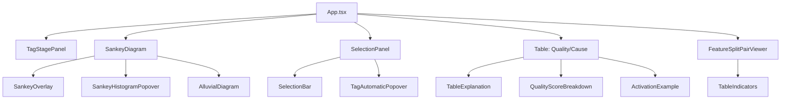

# Frontend CLAUDE.md - SAE Feature Visualization React Application

Professional guidance for the React frontend of the SAE Feature Visualization research prototype.

## 🎯 Frontend Architecture Overview

**Purpose**: Interactive visualization interface for exploring SAE feature explanation reliability
**Status**: Conference-ready research prototype - All 8 phases complete
**Key Innovation**: Smart tree-based Sankey building with frontend-side set intersection

## 🎯 Important Development Principles

### This is a Conference Prototype
- **Avoid over-engineering**: Use straightforward React patterns suitable for research demonstrations
- **Simple solutions first**: Don't add complex state management, optimization, or abstraction unless clearly needed
- **Research-focused**: Prioritize easy modification and exploration over production patterns
- **Demo reliability**: Code should work reliably for demonstrations, not handle every edge case

### Code Quality Guidelines

**Before Making Changes:**
1. **Search existing code**: Use Grep to find similar components or utilities before creating new ones
2. **Check lib/ directory**: Many D3 utilities and helpers already exist - reuse or extend them
3. **Review store/**: Understand existing state management patterns before adding new state
4. **Ask about patterns**: If implementing something that feels common, check if it exists first

**After Making Changes:**
1. **Remove dead code**: Delete unused components, functions, and imports
2. **Clean up styles**: Remove unused CSS classes, especially in component-specific CSS files
3. **Update types**: Keep types.ts synchronized with your changes
4. **Test the demo**: Verify the feature works for basic conference demonstration scenarios

**Code Reuse:**
- **D3 utilities**: Check lib/ for existing D3 calculation functions before writing new ones
- **Store actions**: Extend existing actions rather than creating parallel patterns
- **Common UI patterns**: Look for similar components before creating new ones
- **Modularize when beneficial**: If you write the same logic twice, extract to lib/utils.ts

### 🔄 Recent Updates (November 2025)
**Major Architecture Evolution:**
- **3-Stage Tag Workflow**: Quality Assessment → Feature Splitting Detection → Root Cause Analysis
- **Unified Selection System**: SelectionPanel.tsx handles all 3 modes (feature/pair/cause)
- **Component Consolidation**: TagStagePanel.tsx replaces TagCategoryPanel.tsx
- **Store Modularization**: table-actions.ts split into mode-specific modules
- **Sankey Refactoring**: Split into sankey-builder.ts, sankey-d3-converter.ts, sankey-stages.ts

**New Components:**
- `SelectionPanel.tsx` - Unified selection panel for all table modes
- `SelectionBar.tsx` - Standalone selection state visualization
- `FeatureSplitPairViewer.tsx` - Interactive pair similarity viewer
- `TagAutomaticPanel.tsx` - Automatic tagging interface
- `TagAutomaticPopover.tsx` - Histogram-based threshold tagging
- `CauseTable.tsx` - Root cause analysis table
- `TableIndicators.tsx` - Visual indicators for table cells
- `ActivationExample.tsx` - Display feature activation examples

**Removed/Replaced Components:**
- FeatureSplitOverlay.tsx - Functionality merged into FeatureSplitPairViewer
- FeatureSplitTable.tsx - Replaced by integrated table system
- TagCategoryPanel.tsx → TagStagePanel.tsx - Renamed and refactored

## 🔄 Data Flow Through Frontend

### High-Level Component Flow


### Detailed Data Flow Architecture
```
┌─────────────────────────────────────────────────────────────────────────────┐
│                           USER INTERACTION                                  │
│  Click Node → Select Metric → Adjust Thresholds → View Results             │
└─────────────────────────────────────────────────────────────────────────────┘
                                      ↓
┌─────────────────────────────────────────────────────────────────────────────┐
│                          ZUSTAND STORE ACTION                               │
│  addStageToNode() → Check Cache → Fetch Groups → Build Tree                │
└─────────────────────────────────────────────────────────────────────────────┘
                                      ↓
┌─────────────────────────────────────────────────────────────────────────────┐
│                         TREE BUILDING ALGORITHM                             │
│                                                                             │
│  1. Get parent node from Map<nodeId, SankeyTreeNode>                       │
│  2. For each feature group from backend:                                   │
│     - Compute: childFeatures = parent.featureIds ∩ group.feature_ids      │
│     - If childFeatures.size > 0: Create child node                         │
│  3. Store child nodes in tree Map                                         │
│  4. Recompute Sankey structure for D3                                     │
└─────────────────────────────────────────────────────────────────────────────┘
                                      ↓
┌─────────────────────────────────────────────────────────────────────────────┐
│                         D3.JS VISUALIZATION                                 │
│  Transform tree to nodes/links → Calculate positions → Render SVG          │
└─────────────────────────────────────────────────────────────────────────────┘
```

## 🏗️ Core Architecture Components

### 1. Tree-Based Sankey Building System

#### The Innovation
Instead of backend computing the entire tree, frontend builds it dynamically:

```typescript
// Traditional: Backend sends complete tree
{
  nodes: [{id, depth, parent, children, features}],
  links: [{source, target, value}]
}

// Our Approach: Backend sends simple groups, frontend builds tree
Backend: {groups: [{feature_ids, range_label}]}
Frontend: Tree Building with Set Intersection
```

#### Implementation Details

**Data Structures**:
```typescript
// Tree node structure (store/types.ts)
interface SankeyTreeNode {
  id: string                    // Unique identifier (e.g., "root", "stage0_group1")
  parentId: string | null       // Parent node reference
  metric: string | null         // Metric used for splitting
  thresholds: number[]          // Threshold values for this stage
  depth: number                 // Tree depth level
  children: string[]            // Child node IDs
  featureIds: Set<number>       // Feature IDs at this node
  featureCount: number          // Size of featureIds
  rangeLabel: string           // Display label (e.g., "< 0.30")
}

// Global feature group cache
featureGroupCache: Record<string, FeatureGroup[]>
// Key format: "metric:threshold1,threshold2,..."
// Example: "semdist_mean:0.3,0.7"
```

**Tree Building Algorithm** (store/sankey-actions.ts):
```typescript
async function addUnsplitStageToNode(nodeId: string, metric: string) {
  // 1. Generate cache key
  const cacheKey = `${metric}:${thresholds.join(',')}`

  // 2. Check cache or fetch
  let groups = featureGroupCache[cacheKey]
  if (!groups) {
    groups = await api.getFeatureGroups(filters, metric, thresholds)
    featureGroupCache[cacheKey] = groups
  }

  // 3. Build child nodes
  const parent = sankeyTree.get(nodeId)
  for (const group of groups) {
    // Set intersection: O(min(|A|,|B|))
    const childFeatures = intersection(parent.featureIds, group.feature_ids)

    if (childFeatures.size > 0) {
      const childNode: SankeyTreeNode = {
        id: `${nodeId}_${metric}_group${group.group_index}`,
        parentId: nodeId,
        featureIds: childFeatures,
        featureCount: childFeatures.size,
        metric,
        thresholds,
        rangeLabel: group.range_label,
        depth: parent.depth + 1,
        children: []
      }

      // Add to tree
      sankeyTree.set(childNode.id, childNode)
      parent.children.push(childNode.id)
    }
  }

  // 4. Recompute D3 structure
  recomputeSankeyTree()
}
```

**Performance Benefits**:
- **Cache Hit**: Instant tree rebuild (no backend call)
- **Cache Miss**: ~50ms for new feature groups
- **Set Intersection**: O(min(|A|,|B|)) complexity
- **Threshold Changes**: Local recomputation only

### 2. Zustand State Management

#### Store Architecture (Modularized)
```
store/
├── index.ts           # Main store composition
├── sankey-actions.ts  # Sankey tree operations
├── table-actions.ts   # Table data operations
└── utils.ts          # Helper functions
```

#### Key State Structure
```typescript
interface AppState {
  // Dual-panel architecture
  leftPanel: PanelState
  rightPanel: PanelState

  // Global state
  featureGroupCache: Record<string, FeatureGroup[]>
  currentMetric: MetricType
  showComparisonView: boolean

  // Visualization data
  alluvialFlows: AlluvialFlow[] | null
  tableData: FeatureTableDataResponse | null

  // Actions (from sankey-actions.ts)
  addUnsplitStageToNode: (nodeId, metric, panel?) => Promise<void>
  updateNodeThresholds: (nodeId, thresholds, panel?) => Promise<void>
  removeNodeStage: (nodeId, panel?) => void
  recomputeSankeyTree: (panel?) => void

  // Actions (from table-actions.ts)
  fetchTableData: () => Promise<void>
  setTableSort: (sortBy, direction) => void
  swapMetricDisplay: (metric) => void
}
```

### 3. Component Architecture

#### Major Components & Their Roles

**App.tsx** - Main Orchestrator
- Health check on startup
- View state management (empty → filtering → visualization)
- Error boundary integration
- Layout orchestration

**SankeyDiagram.tsx** - Tree Visualization
- D3-Sankey integration
- Inline histogram rendering
- Node click handling → SankeyOverlay
- Threshold handle integration

**SankeyOverlay.tsx** - Stage Addition UI
- Metric selection interface
- Threshold input/preset selection
- Calls `addUnsplitStageToNode()`

**AlluvialDiagram.tsx** - Cross-Panel Flows
- Visualizes feature flow between panels
- Calculates consistency between trees
- Overlay on comparison view

**QualityTable.tsx** - Quality Assessment Table
- 824 rows of feature scores
- 5 consistency visualization modes
- Cell group selection
- Explanation highlighting

**CauseTable.tsx** - Root Cause Analysis Table
- 3-category tagging: noisy-activation, missed-lexicon, missed-context
- Color-coded cause indicators
- Integrated with tag workflow

**SelectionPanel.tsx** - Unified Selection Interface
- Handles 3 modes: feature, pair, cause
- Selection state bar with 4 categories (confirmed, expanded, rejected, unsure)
- Auto-tagging preview integration
- Mode-specific filtering and actions

**SelectionBar.tsx** - Selection State Visualization
- Horizontal stacked bar showing distribution
- 4 selection categories with color encoding
- Preview state with stripe pattern overlay
- Interactive category filtering

**FeatureSplitPairViewer.tsx** - Feature Pair Analysis
- Interactive similarity pair exploration
- Top-4 decoder similarity visualization
- Clustering integration
- Selection and rejection interface

**TagStagePanel.tsx** - Tag Stage Management
- 3-stage workflow: Quality → Feature Splitting → Cause
- Stage activation and navigation
- Progress tracking across stages

**TagAutomaticPanel.tsx** - Automatic Tagging Controls
- Histogram-based threshold configuration
- Batch tagging operations
- Preview before apply

**TagAutomaticPopover.tsx** - Threshold Tagging Interface
- Histogram visualization with draggable thresholds
- Real-time preview of tagging effects
- Minimize/restore functionality

**HistogramPopover.tsx** - Threshold Visualization
- Portal-based rendering
- Multi-histogram support
- Drag functionality
- Real-time updates

## 📊 Key Implementation Patterns

### React-D3 Integration Pattern
```typescript
// Proper separation of concerns
function SankeyDiagram() {
  const svgRef = useRef<SVGSVGElement>(null)
  const [dimensions, setDimensions] = useState({width: 0, height: 0})

  // Use ResizeObserver for responsive sizing
  useResizeObserver(containerRef, ({width, height}) => {
    setDimensions({width, height})
  })

  // D3 calculations in useMemo
  const {nodes, links} = useMemo(() => {
    if (!sankeyData) return {nodes: [], links: []}
    return calculateSankeyLayout(sankeyData, dimensions.width, dimensions.height)
  }, [sankeyData, dimensions])

  // React renders using D3-calculated positions
  return (
    <svg ref={svgRef}>
      {nodes.map(node => (
        <g key={node.id} transform={`translate(${node.x0},${node.y0})`}>
          {/* Node rendering */}
        </g>
      ))}
    </svg>
  )
}
```

### API Integration Pattern
```typescript
// api.ts - Centralized API client
const apiClient = axios.create({
  baseURL: 'http://localhost:8003',
  timeout: 10000,
  headers: {'Content-Type': 'application/json'}
})

// Type-safe API functions
export async function getFeatureGroups(
  filters: Filters,
  metric: string,
  thresholds: number[]
): Promise<FeatureGroup[]> {
  const response = await apiClient.post<FeatureGroupResponse>(
    '/api/feature-groups',
    {filters, metric, thresholds}
  )
  return response.data.groups
}
```

### Performance Optimization Patterns
```typescript
// Memoization for expensive calculations
const processedData = useMemo(() =>
  computeExpensiveData(rawData),
  [rawData]
)

// Debouncing for user interactions
const debouncedUpdate = useMemo(
  () => debounce(updateThresholds, 300),
  [updateThresholds]
)

// React.memo for expensive components
export const ExpensiveViz = React.memo(({data}) => {
  // Component implementation
}, (prevProps, nextProps) => {
  // Custom comparison
  return prevProps.data.id === nextProps.data.id
})
```

## 🛠️ Technology Stack Details

### Core Libraries
- **React 19.1.1**: Latest React with concurrent features
- **TypeScript 5.8.3**: Full type safety
- **Vite 7.1.6**: Lightning-fast dev server
- **Zustand 5.0.8**: Lightweight state management
- **Axios 1.12.2**: HTTP client with interceptors

### D3.js Ecosystem
- **d3-sankey 0.12.3**: Sankey layout algorithms
- **d3-scale 4.0.2**: Data scaling functions
- **d3-array 3.2.4**: Array manipulation utilities
- **d3-selection 3.0.0**: DOM manipulation
- **d3-transition 3.0.1**: Smooth animations
- **d3-interpolate 3.0.1**: Value interpolation
- **d3-polygon 3.0.1**: Convex hulls for UMAP
- **d3-zoom 3.0.0**: Pan and zoom interactions

## 📁 Frontend Project Structure

```
frontend/src/
├── components/                    # React Components
│   ├── SankeyDiagram.tsx         # Main Sankey visualization
│   ├── SankeyOverlay.tsx         # Stage addition interface
│   ├── SankeyHistogramPopover.tsx # Histogram popover with thresholds
│   ├── ThresholdHandles.tsx      # Interactive threshold handles
│   ├── AlluvialDiagram.tsx       # Cross-panel flows
│   ├── QualityTable.tsx          # Quality assessment table
│   ├── CauseTable.tsx            # Root cause analysis table
│   ├── FeatureSplitPairViewer.tsx # Feature pair similarity viewer
│   ├── TagStagePanel.tsx         # 3-stage workflow management
│   ├── TagAutomaticPanel.tsx     # Automatic tagging controls
│   ├── TagAutomaticPopover.tsx   # Threshold tagging popover
│   ├── SelectionPanel.tsx        # Unified selection panel (3 modes)
│   ├── SelectionBar.tsx          # Selection state visualization
│   ├── ActivationExample.tsx     # Activation examples display
│   ├── TableExplanation.tsx      # Explanation text display
│   ├── TableIndicators.tsx       # Visual table indicators
│   ├── QualityScoreBreakdown.tsx # Score details breakdown
│   ├── AppHeader.tsx             # App header
│   └── _FlowPanel.tsx            # (Deprecated) Flow container
├── lib/                          # Utilities
│   ├── constants.ts              # App constants
│   ├── sankey-builder.ts         # Sankey tree builder (refactored)
│   ├── sankey-d3-converter.ts    # D3 data conversion (refactored)
│   ├── sankey-stages.ts          # Stage management logic (refactored)
│   ├── sankey-utils.ts           # Sankey calculations
│   ├── sankey-histogram-utils.ts # Inline histogram rendering
│   ├── alluvial-utils.ts         # Alluvial flow calculations
│   ├── histogram-utils.ts        # Histogram data processing
│   ├── table-utils.ts            # Table layout & rendering
│   ├── table-color-utils.ts      # Table color encoding
│   ├── circle-encoding-utils.ts  # Circle visualization utils
│   ├── activation-utils.ts       # Activation data processing
│   ├── flow-utils.ts             # Flow utilities
│   ├── threshold-utils.ts        # Tree building logic
│   ├── tag-utils.ts              # Tag processing
│   ├── tag-constants.ts          # Tag definitions (3-stage workflow)
│   ├── hierarchical-colors.ts    # Color schemes
│   └── utils.ts                  # General helpers
├── store/                        # State Management (Zustand)
│   ├── index.ts                  # Main store composition
│   ├── sankey-actions.ts         # Sankey tree operations
│   ├── table-actions-quality.ts  # Quality table mode (refactored)
│   ├── table-actions-feature-splitting.ts # Pair mode (refactored)
│   ├── table-actions-cause.ts    # Cause table mode (refactored)
│   ├── table-actions-common.ts   # Shared table operations (refactored)
│   ├── tag-actions.ts            # Tag management actions
│   ├── activation-actions.ts     # Activation data actions
│   └── utils.ts                  # Store helper functions
├── styles/                       # CSS Files
│   ├── base.css                  # Global styles
│   ├── App.css                   # App-level styles
│   ├── SankeyDiagram.css         # Sankey styles
│   ├── SankeyHistogramPopover.css # Histogram popover
│   ├── AlluvialDiagram.css       # Alluvial styles
│   ├── QualityTable.css          # Quality table styles
│   ├── CauseTable.css            # Cause table styles
│   ├── FeatureSplitPairViewer.css # Pair viewer styles
│   ├── TagStagePanel.css         # Tag panel styles
│   ├── TagAutomaticPanel.css     # Tag automatic panel styles
│   ├── TagAutomaticPopover.css   # Tag popover styles
│   ├── SelectionPanel.css        # Selection panel
│   ├── SelectionBar.css          # Selection bar
│   ├── ActivationExample.css     # Activation display
│   ├── AppHeader.css             # Header styles
│   └── FlowPanel.css             # (Legacy)
├── assets/                       # Static assets
├── types.ts                      # TypeScript type definitions
├── api.ts                        # API client (Axios)
├── App.tsx                       # Main application component
├── main.tsx                      # Entry point
├── index.css                     # Root CSS
└── vite-env.d.ts                 # Vite type declarations
```

**Note**: Clean up unused CSS files and components after modifications. Remove legacy components prefixed with `_` when no longer referenced.

## 🚀 Development Workflow

### Starting Development
```bash
cd frontend

# Install dependencies
npm install

# Start dev server (default port 3000)
npm run dev

# Start on specific port (currently 3003)
npm run dev -- --port 3003
```

### Build & Deploy
```bash
# Build for production
npm run build

# Preview production build
npm run preview

# Lint code
npm run lint
```

### Development Features
- **Hot Module Replacement**: Instant updates without full reload
- **TypeScript Checking**: Real-time type validation
- **Error Overlay**: Clear error messages in browser
- **Source Maps**: Debug original source in DevTools
- **React DevTools**: Component tree inspection
- **Zustand DevTools**: State debugging support

## 📊 Implementation Status Details

### Phase Completion Summary
| Phase | Feature | Status | Key Components |
|-------|---------|--------|----------------|
| 1 | Dual Sankey | ✅ Complete | SankeyDiagram, TagStagePanel |
| 2 | Tree Building | ✅ Complete | sankey-builder, sankey-stages |
| 3 | Performance | ✅ Complete | Feature group cache, set intersection |
| 4 | Threshold Groups | ✅ Complete | SankeyHistogramPopover, ThresholdHandles |
| 5 | LLM Comparison | ✅ Complete | FeatureSplitPairViewer, clustering |
| 6 | UMAP | ✅ Complete | Alluvial flows |
| 7 | Quality Table | ✅ Complete | QualityTable, SelectionPanel |
| 8 | Consistency | ✅ Complete | 8 metrics integrated |
| 9 | Tag Workflow | ✅ Complete | 3-stage workflow with auto-tagging |
| 10 | Cause Analysis | ✅ Complete | CauseTable, 3-category system |

### Current Active Features
- **3-Stage Tag Workflow**: Quality Assessment → Feature Splitting → Root Cause Analysis
- **Tree-Based Sankey**: Dynamic tree building with instant updates
- **Inline Histograms**: Embedded directly on Sankey nodes
- **Comparison Overlay**: Toggle between single/comparison view
- **Unified Selection System**: 4-category selection (confirmed, expanded, rejected, unsure)
- **Auto-Tagging**: Histogram-based threshold tagging with preview
- **Feature Split Analysis**: Pair similarity with clustering support
- **Tag Category Management**: 3-stage workflow navigation
- **Explanation Highlighting**: Semantic alignment-based coloring
- **Quality Score Breakdown**: Detailed metric contributions
- **Activation Examples**: Display feature activation examples
- **Cause Analysis**: 3-category root cause tagging

## 🎯 Performance Characteristics

### Optimization Metrics
- **Initial Load**: < 1 second
- **Tree Building**: ~50ms (new), instant (cached)
- **Threshold Update**: Instant (no backend call)
- **Sankey Render**: < 100ms for 1,648 features
- **Table Render**: < 200ms for 824 rows
- **Memory Usage**: ~50MB baseline

### Key Optimizations
1. **Feature Group Caching**: Eliminates redundant API calls
2. **Set Intersection**: O(min(|A|,|B|)) complexity
3. **React.memo**: Prevents unnecessary re-renders
4. **useMemo**: Caches expensive calculations
5. **Lazy Loading**: Components loaded on demand
6. **Debouncing**: 300ms for smooth interactions

## 🔧 Frontend-Specific Guidelines

### Code Standards
```typescript
// Always use TypeScript interfaces
interface ComponentProps {
  data: SankeyData
  onNodeClick: (nodeId: string) => void
}

// Prefer functional components with hooks
function MyComponent({data, onNodeClick}: ComponentProps) {
  // Implementation
}

// Use proper error handling for demos
try {
  const result = await api.fetchData()
  // Handle success
} catch (error) {
  console.error('Failed to fetch:', error)
  // Show user-friendly error for conference demo
}
```

### State Management Rules
1. **Never mutate state directly** - Use Zustand actions
2. **Keep derived state in useMemo** - Don't store in Zustand
3. **Use proper typing** - All state must be typed
4. **Action naming** - Use verb prefixes (set, update, fetch, etc.)
5. **Check existing actions** - Before adding new state or actions, verify similar patterns don't exist

### Component Guidelines
1. **Single Responsibility** - One component, one purpose
2. **Props Interface** - Always define TypeScript interface
3. **Keep it simple** - Don't add complex error boundaries unless necessary for demo reliability
4. **Responsive Design** - Use ResizeObserver for D3 visualizations
5. **Reuse patterns** - Check existing components for similar implementations

## 🐛 Common Issues & Solutions

### Issue: Sankey not updating after threshold change
**Solution**: Ensure `recomputeSankeyTree()` is called after tree modification

### Issue: API calls failing with CORS
**Solution**: Backend must include frontend port in CORS origins

### Issue: Performance degradation with large datasets
**Solution**: Implement virtualization for long lists, use React.memo (especially for QualityTablePanel with 824 rows)

### Issue: State updates not reflected
**Solution**: Check Zustand action is properly updating state

### Issue: Feature split overlays not displaying correctly
**Solution**: Ensure FeatureSplitOverlay and FeatureSplitTable components are properly receiving data from the store

## 📈 Future Enhancements

### Planned Features
- Export visualization as SVG/PNG
- Undo/redo for tree operations
- Keyboard shortcuts for common actions
- Advanced filtering UI with query builder
- Real-time collaboration support

### Performance Improvements (If Needed)
- Virtual scrolling for QualityTablePanel if performance becomes an issue
- Debouncing for smooth interactions (already implemented)
- Memoization for expensive calculations (already implemented)
- Note: Avoid premature optimization - profile first

## 🎓 Key Takeaways

The frontend implements a **smart client architecture** where:
1. **Backend provides simple data** (feature groups)
2. **Frontend builds complex structures** (Sankey tree)
3. **Caching enables instant updates** (no backend calls for cached data)
4. **Set intersection ensures correctness** (proper feature filtering)
5. **Modular state management** (clean separation of concerns)

This architecture provides:
- ⚡ **Instant threshold updates** without backend calls
- 🎯 **Precise feature tracking** through set operations
- 📊 **Rich visualizations** with D3.js integration
- 🔄 **Real-time interactivity** for research exploration
- 🏆 **Conference-ready reliability** for demonstrations

---

## 💡 Remember

**This is a research prototype for conference demonstrations**

When working on frontend code:
- **Avoid over-engineering**: Use simple React patterns suitable for research demonstrations
- **Clean up after changes**: Remove unused components, functions, styles, and imports
- **Reuse existing code**: Check lib/, store/, and components/ before implementing new features
- **Modularize when needed**: Extract common patterns, but don't create unnecessary abstractions
- **Focus on demos**: Ensure features work reliably for conference presentations

The goal is a flexible, maintainable visualization tool, not a production application.